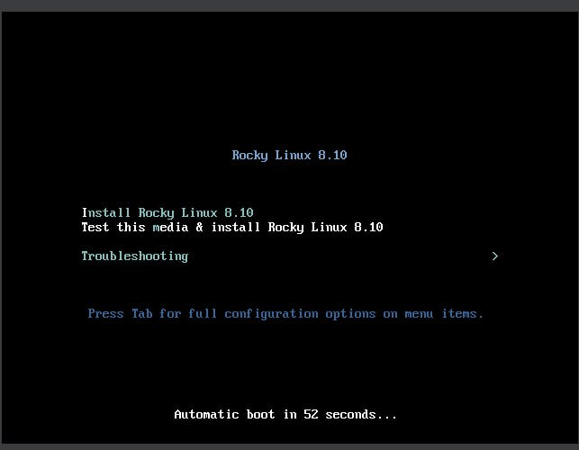
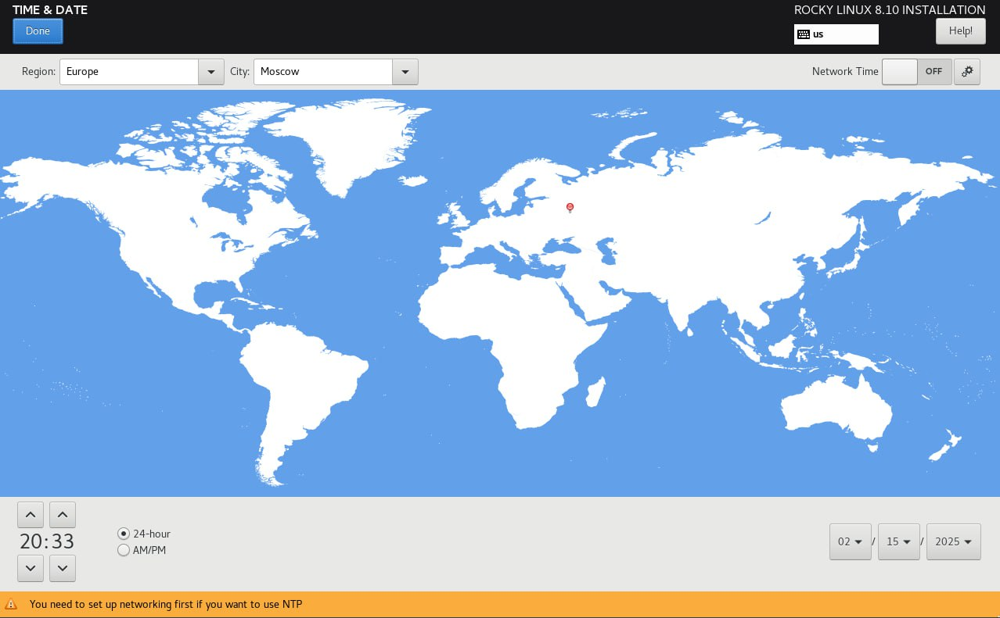
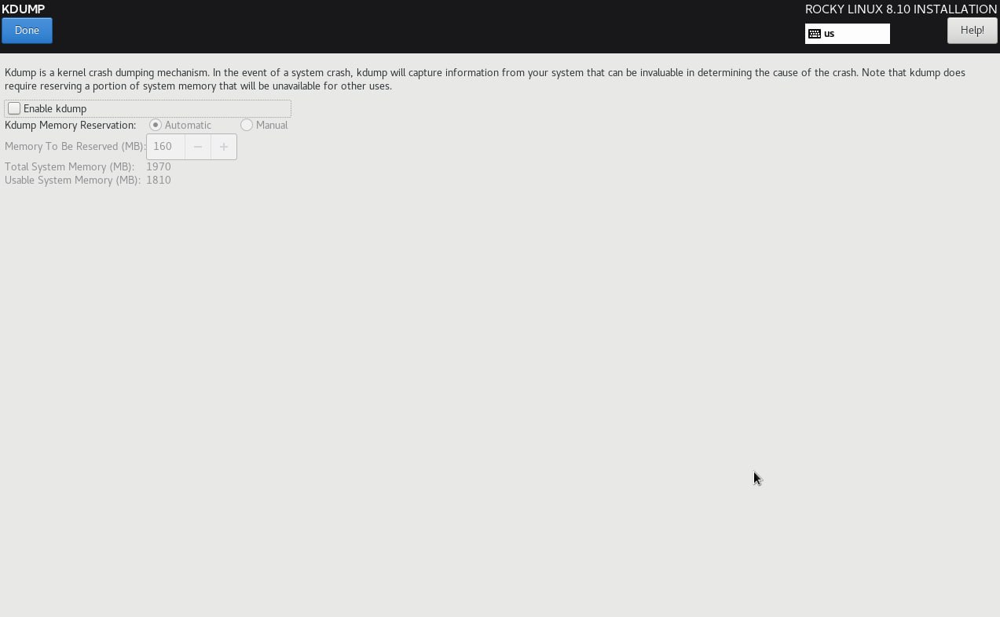
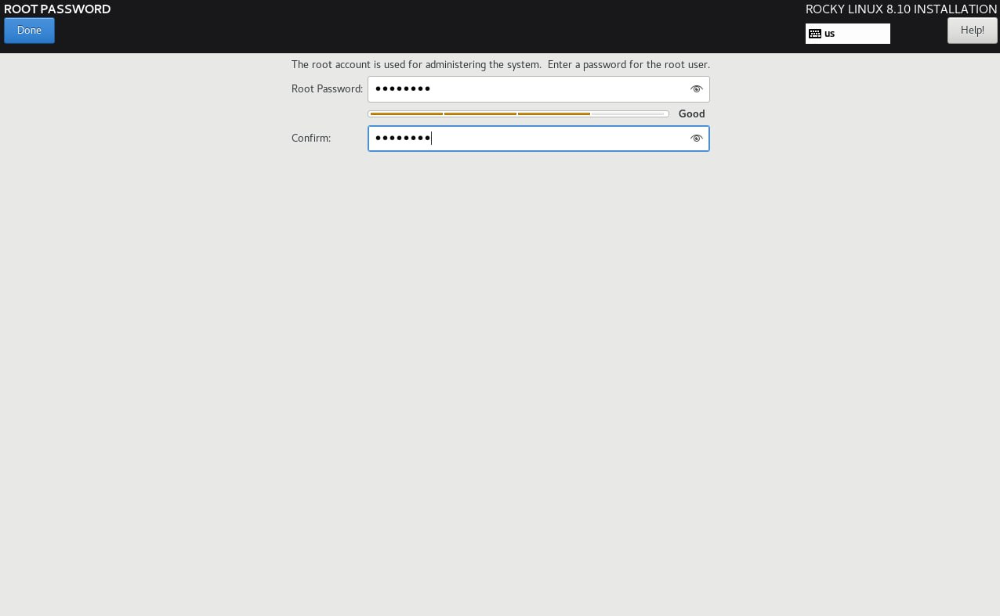
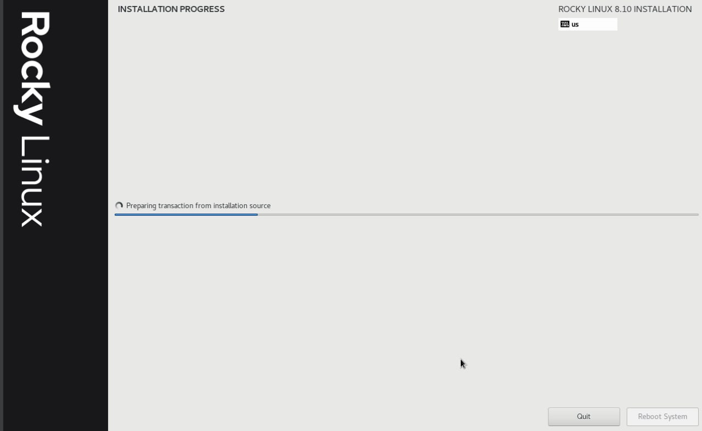
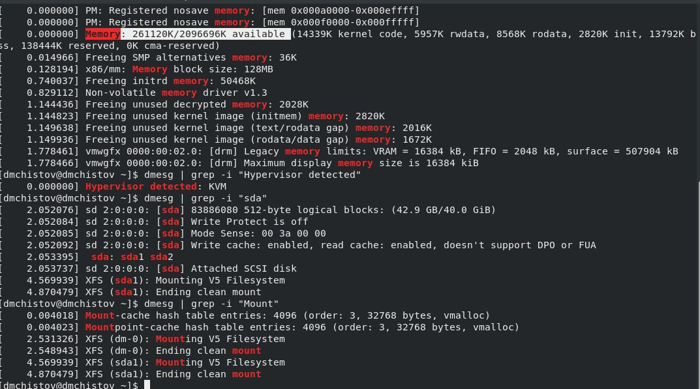

---
## Front matter
title: "Отчёт по лабораторной работе №1"
subtitle: "Основы информационной безопасности"
author: "Чистов Даниил Максимович"

## Generic otions
lang: ru-RU
toc-title: "Содержание"

## Bibliography
bibliography: bib/cite.bib
csl: pandoc/csl/gost-r-7-0-5-2008-numeric.csl

## Pdf output format
toc: true # Table of contents
toc-depth: 2
lof: true # List of figures
lot: false # List of tables
fontsize: 12pt
linestretch: 1.5
papersize: a4
documentclass: scrreprt
## I18n polyglossia
polyglossia-lang:
  name: russian
  options:
	- spelling=modern
	- babelshorthands=true
polyglossia-otherlangs:
  name: english
## I18n babel
babel-lang: russian
babel-otherlangs: english
## Fonts
mainfont: IBM Plex Serif
romanfont: IBM Plex Serif
sansfont: IBM Plex Sans
monofont: IBM Plex Mono
mathfont: STIX Two Math
mainfontoptions: Ligatures=Common,Ligatures=TeX,Scale=0.94
romanfontoptions: Ligatures=Common,Ligatures=TeX,Scale=0.94
sansfontoptions: Ligatures=Common,Ligatures=TeX,Scale=MatchLowercase,Scale=0.94
monofontoptions: Scale=MatchLowercase,Scale=0.94,FakeStretch=0.9
mathfontoptions:
## Biblatex
biblatex: true
biblio-style: "gost-numeric"
biblatexoptions:
  - parentracker=true
  - backend=biber
  - hyperref=auto
  - language=auto
  - autolang=other*
  - citestyle=gost-numeric
## Pandoc-crossref LaTeX customization
figureTitle: "Рис."
tableTitle: "Таблица"
listingTitle: "Листинг"
lofTitle: "Список иллюстраций"
lotTitle: "Список таблиц"
lolTitle: "Листинги"
## Misc options
indent: true
header-includes:
  - \usepackage{indentfirst}
  - \usepackage{float} # keep figures where there are in the text
  - \floatplacement{figure}{H} # keep figures where there are in the text
---

# Цель работы

Целью данной работы является приобретение практических навыков установки операционной системы на виртуальную машину, настройки минимально необходимых для дальнейшей работы сервисов

# Задания

1. Настройка виртуальной машины и установка операционной системы
2. Домашнее задание

# Выполнение лабораторной работы

## Настройка виртуальной машины и установка операционной системы

Я выполнял работу дома на стационарном компьютере, пользовался VirtualBox, по заданию требуется поставить ОС Rocky, я скачал её образ с официального сайта. Перейдём к процессу настройки виртуальной машины.

Задаю имя виртуальной машины согласно требованиям к наименованию, также задаю путь и выбираю нужный образ, скачанный с интернета (рис. [-@fig:001]).

{#fig:001 width=70%}

Выбираю кол-во процессоров и выделяю нужное мне кол-во памяти (рис. [-@fig:002]).

{#fig:002 width=70%}

Выделяю нужное количество память жёсткого диска для моей виртуальной машины (рис. [-@fig:003]).

{#fig:003 width=70%}

Итоговые настройки моей виртуальной машины (рис. [-@fig:004]).

{#fig:004 width=70%}

Запускаю виртуальную машину и вижу, что установка успешно начата (рис. [-@fig:005]).

{#fig:005 width=70%}

Задаю язык операционной системы (рис. [-@fig:006]).

{#fig:006 width=70%}

Задаю часовой пояс операционной системы - Москва, Московское время(рис. [-@fig:007]).

{#fig:007 width=70%}

В разделе выбора программ, указываю базовое окружение - Server with GUI, а в качестве дополнения - Development tools (рис. [-@fig:008]).

{#fig:008 width=70%}

Настриваю клавиатуру - выбираю раскладку: русскую и английскую (рис. [-@fig:009]).

{#fig:009 width=70%}

Отключаю KDUMP (рис. [-@fig:010]).

{#fig:010 width=70%}

Включаю сетевое соединение, а в качестве имени узла указываю dmchistov.localdomain (рис. [-@fig:011]).

{#fig:011 width=70%}

Устанавливаю пароль для root (рис. [-@fig:012]).

{#fig:012 width=70%}

Создаю пользователя dmchistov и задаю ему пароль (рис. [-@fig:013]).

{#fig:013 width=70%}

Выбираю свой виртуальный жёсткий диск (рис. [-@fig:014]).

{#fig:014 width=70%}

Начальная настройка операционной системы завершена, перейду к установке (рис. [-@fig:015]).

{#fig:015 width=70%}

Установка (рис. [-@fig:016]).

{#fig:016 width=70%}

Установка завершена (рис. [-@fig:017]).

{#fig:017 width=70%}

Проверяю, что образ успешно автоматически исчез после установки и больше и не используется (рис. [-@fig:018]).

{#fig:018 width=70%}

Подтверждаю лицензионное соглашение (рис. [-@fig:019]).

{#fig:019 width=70%}

После успешной установки, также подключу образ с доплнениями к моей ОС (рис. [-@fig:020]).

{#fig:020 width=70%}

## Домашнее задание

По заданию мне требуется узнать утилитой dmesg следующие вещи:

1. Версия ядра Linux (Linux version).

2. Частота процессора (Detected Mhz processor).

3. Модель процессора (CPU0).

4. Объем доступной оперативной памяти (Memory available).

5. Тип обнаруженного гипервизора (Hypervisor detected).

6. Тип файловой системы корневого раздела.

7. Последовательность монтирования файловых систем.

По мере выполнения задания я использовал информацию в интернете о команде dmesg, ссыкла будет прикреплена в источниках.

Пока просто посмотрю вывод этой команды, написав dmesg | less (рис. [-@fig:021]).

{#fig:021 width=70%}

Используя dmesg | grep -i "" (в кавычках пишу то, что ищу), нахожу всё, что мне надо по заданию. Для начала - Linux Version, Mhz processor, CPU0 (рис. [-@fig:022]).

{#fig:022 width=70%}

Также узнаю о кол-ве доступной памяти, типе гипервизора, типе файловой системы и о последовательности монтирования файловых систем (рис. [-@fig:023]).

{#fig:023 width=70%}

# Выводы

При выполнении данной лаборатоной работы я приобрёл практические навыки установки операционной системы на виртуальную машину, настройки минимально необходимых для дальнейшей работы сервисов

# Список литературы{.unnumbered}

[Лабораторная работы №1](https://esystem.rudn.ru/pluginfile.php/2580589/mod_folder/content/0/001-lab_virtualbox.pdf)

[Команда dmesg](https://phoenixnap.com/kb/dmesg-linux#:~:text=The%20dmesg%20command%20is%20a,module%20messages%20during%20system%20startup)
