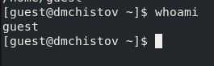

---
## Front matter
lang: ru-RU
title: Лабораторная работа №2
subtitle: Основы информационной безопасности
author:
  - Чистов Д. М.
institute:
  - Российский университет дружбы народов, Москва, Россия
  - Объединённый институт ядерных исследований, Дубна, Россия
date: 8 марта 2025

## i18n babel
babel-lang: russian
babel-otherlangs: english

## Formatting pdf
toc: false
toc-title: Содержание
slide_level: 2
aspectratio: 169
section-titles: true
theme: metropolis
header-includes:
 - \metroset{progressbar=frametitle,sectionpage=progressbar,numbering=fraction}
---

# Цель работы

Получение практических навыков работы в консоли с атрибутами файлов, закрепление теоретических основ дискреционного разграничения доступа в современных системах с открытым кодом на базе ОС Linux

# Задания

1. Знакомство с пользователями и их аттрибутами
2. Заполнение таблиц 2.1 и 2.2

# Выполнение лабораторной работы

## Знакомство с пользователями и их аттрибутами

Добавляю нового пользователя - guest, затем задаю ему пароль.

{#fig:001 width=70%}

## Знакомство с пользователями и их аттрибутами

Видно, что новый пользователь успешно создан. Захожу в него.

{#fig:002 width=70%}

## Знакомство с пользователями и их аттрибутами

Командой pwd определяю своё местоположение в файловой системе - я нахожусь в домашнем каталоге пользователя guest, это также можно было определить по значку ~ в командной строке.

{#fig:003 width=70%}

## Знакомство с пользователями и их аттрибутами

Командой whoami, уточняю имя пользователя - guest.

{#fig:004 width=70%}

## Знакомство с пользователями и их аттрибутами

Командой id получаю информацию о uid и gid - таким образом я получил id пользователя и его группы, затем командой groups вывожу группу - там также указана группа guest.

{#fig:005 width=70%}

## Знакомство с пользователями и их аттрибутами

Командой cat /etc/passwd | grep guest (grep guest пишу, чтобы прочитать информацию исключительно о нашем пользователе - guest) определяю uid и gid пользователя, сравниваю их с выводом команды id, всё совпадает.

{#fig:006 width=70%}

## Знакомство с пользователями и их аттрибутами

Командой ls -l /home/ определяю существующие в ситеме директории - определил, что в home теперь домашняя директория пользователя guest и домашняя директория пользователя dmchistov - моего основого пользователя. Права у каждых директорий стоят полные для пользователей (700).

{#fig:007 width=70%}

## Знакомство с пользователями и их аттрибутами

Командой lsattr определяю расширенные атрибуты каждой директории внутри /home, однако мне не удалось узнать об аттрибутах директории dmchistov, т.к. это другой пользователь, зато получилось узнать об аттрибутах пользователя guest.

{#fig:008 width=70%}

## Знакомство с пользователями и их аттрибутами

Создаю директорию dir1 и командой ls -l узнаю о её правах.

{#fig:009 width=70%}

## Знакомство с пользователями и их аттрибутами

Командой chmod 000 dir1, снимаю все атрибуты с директории dir1, командой ls -l подтверждаю, что у директории больше нет никаких прав.

{#fig:010 width=70%}

## Знакомство с пользователями и их аттрибутами

Попытаюсь создать в директории dir1 файл, однако получаю отказ, т.к. ранее я снял все права доступа к этой директории, поэтому ни один пользователь не может получить доступ к этой папке, соответственно и не может создать файл.

{#fig:011 width=70%}

# Заполнение таблиц 2.1 и 2.2

Теперь, перехожу к заполнению таблиц - требуется определить опытным путём, какие комбинации прав для файла и директории позволяет пользователю совершать те или иные действия с директориями и файлами внутри них.

## Как работает системе нумерации прав

В интернете я нашёл удобную схему, которая показывает число и соответствуещее ему право:

{#fig:012 width=70%}

## Заполнение таблиц 2.1 и 2.2

Пользуясь такой схемой, сначала я устанавливал права для директории, затем устанвалил каждый тип прав для файла, внутри этой директории и каждый проверял те или иные действия, затем заносил результат в таблицу. Затем задавал следующие права для директории, заново задавал права для файла и проверял операции. И так далее:

{#fig:013 width=70%}

По итогу получилась вот такая таблица:

## Таблица 2.1 "Установленные права и разрешённые действия"

{#fig:014 width=70%}

## Таблица 2.2 "Минимальные права для совершения операций"

Опираясь на эту таблицу, я заполнил таблицу 2.2. Там просто требуется определить какие минимальные права нужны для файла и директории, чтобы выполнить ту или иную операцию.

{#fig:015 width=70%}

# Выводы

При выполнении данной лаборатоной работы я получил практические навыки работы в консоли с атрибутами файлов, закрепил теоретические основы дискреционного разграничения доступа в современных системах с открытым кодом на базе ОС Linux

# Список литературы

[Лабораторная работы №2](https://esystem.rudn.ru/pluginfile.php/2580592/mod_resource/content/6/002-lab_discret_attr.pdf)

