---
## Front matter
title: "Отчёт по лабораторной работе №2"
subtitle: "Основы информационной безопасности"
author: "Чистов Даниил Максимович"

## Generic otions
lang: ru-RU
toc-title: "Содержание"

## Bibliography
bibliography: bib/cite.bib
csl: pandoc/csl/gost-r-7-0-5-2008-numeric.csl

## Pdf output format
toc: true # Table of contents
toc-depth: 2
lof: true # List of figures
lot: false # List of tables
fontsize: 12pt
linestretch: 1.5
papersize: a4
documentclass: scrreprt
## I18n polyglossia
polyglossia-lang:
  name: russian
  options:
	- spelling=modern
	- babelshorthands=true
polyglossia-otherlangs:
  name: english
## I18n babel
babel-lang: russian
babel-otherlangs: english
## Fonts
mainfont: IBM Plex Serif
romanfont: IBM Plex Serif
sansfont: IBM Plex Sans
monofont: IBM Plex Mono
mathfont: STIX Two Math
mainfontoptions: Ligatures=Common,Ligatures=TeX,Scale=0.94
romanfontoptions: Ligatures=Common,Ligatures=TeX,Scale=0.94
sansfontoptions: Ligatures=Common,Ligatures=TeX,Scale=MatchLowercase,Scale=0.94
monofontoptions: Scale=MatchLowercase,Scale=0.94,FakeStretch=0.9
mathfontoptions:
## Biblatex
biblatex: true
biblio-style: "gost-numeric"
biblatexoptions:
  - parentracker=true
  - backend=biber
  - hyperref=auto
  - language=auto
  - autolang=other*
  - citestyle=gost-numeric
## Pandoc-crossref LaTeX customization
figureTitle: "Рис."
tableTitle: "Таблица"
listingTitle: "Листинг"
lofTitle: "Список иллюстраций"
lotTitle: "Список таблиц"
lolTitle: "Листинги"
## Misc options
indent: true
header-includes:
  - \usepackage{indentfirst}
  - \usepackage{float} # keep figures where there are in the text
  - \floatplacement{figure}{H} # keep figures where there are in the text
---

# Цель работы

Получение практических навыков работы в консоли с атрибутами файлов, закрепление теоретических основ дискреционного разграничения доступа в современных системах с открытым кодом на базе ОС Linux

# Задания

1. Знакомство с пользователями и их аттрибутами
2. Заполнение таблиц 2.1 и 2.2

# Выполнение лабораторной работы

## Знакомство с пользователями и их аттрибутами

Добавляю нового пользователя - guest, затем задаю ему пароль (рис. [-@fig:001]).

{#fig:001 width=70%}

Видно, что новый пользователь успешно создан. Захожу в него. (рис. [-@fig:002]).

{#fig:002 width=70%}

Командой pwd определяю своё местоположение в файловой системе - я нахожусь в домашнем каталоге пользователя guest, это также можно было определить по значку ~ в командной строке (рис. [-@fig:003]).

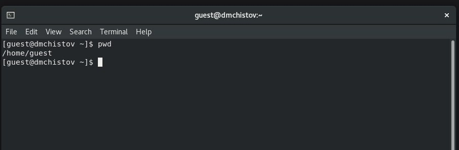{#fig:003 width=70%}

Командой whoami, уточняю имя пользователя - guest (рис. [-@fig:004]).

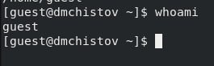{#fig:004 width=70%}

Командой id получаю информацию о uid и gid - таким образом я получил id пользователя и его группы, затем командой groups вывожу группу - там также указана группа guest (рис. [-@fig:005]).

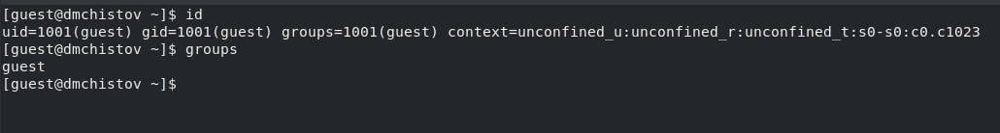{#fig:005 width=70%}

Командой cat /etc/passwd | grep guest (grep guest пишу, чтобы прочитать информацию исключительно о нашем пользователе - guest) определяю uid и gid пользователя, сравниваю их с выводом команды id, всё совпадает (рис. [-@fig:006]).

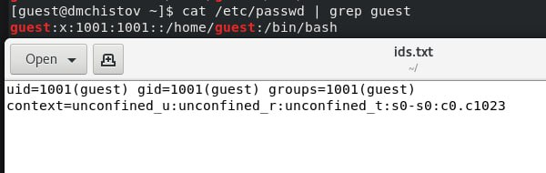{#fig:006 width=70%}

Командой ls -l /home/ определяю существующие в ситеме директории - определил, что в home теперь домашняя директория пользователя guest и домашняя директория пользователя dmchistov - моего основого пользователя. Права у каждых директорий стоят полные для пользователей (700) (рис. [-@fig:007]).

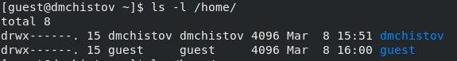{#fig:007 width=70%}

Командой lsattr определяю расширенные атрибуты каждой директории внутри /home, однако мне не удалось узнать об аттрибутах директории dmchistov, т.к. это другой пользователь, зато получилось узнать об аттрибутах пользователя guest (рис. [-@fig:008]).

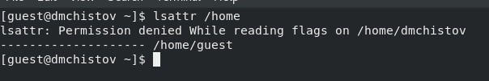{#fig:008 width=70%}

Создаю директорию dir1 и командой ls -l узнаю о её правах (рис. [-@fig:009]).

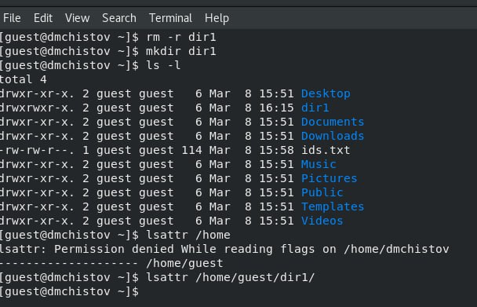{#fig:009 width=70%}

Командой chmod 000 dir1, снимаю все атрибуты с директории dir1, командой ls -l подтверждаю, что у директории больше нет никаких прав (рис. [-@fig:010]).

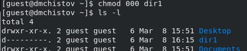{#fig:010 width=70%}

Попытаюсь создать в директории dir1 файл, однако получаю отказ, т.к. ранее я снял все права доступа к этой директории, поэтому ни один пользователь не может получить доступ к этой папке, соответственно и не может создать файл (рис. [-@fig:011]).

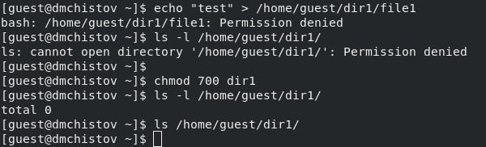{#fig:011 width=70%}

## Заполнение таблиц 2.1 и 2.2

Теперь, перехожу к заполнению таблиц - требуется определить опытным путём, какие комбинации прав для файла и директории позволяет пользователю совершать те или иные действия с директориями и файлами внутри них.

## Как работает системе нумерации прав

В интернете я нашёл удобную схему, которая показывает число и соответствуещее ему право (рис. [-@fig:012]):

1 - execute,
2 - write,
3 - write & execute,
4 - read,
5 - read & execute,
6 - read & write,
7 - read & write & execute

{#fig:012 width=70%}

Пользуясь такой схемой, сначала я устанавливал права для директории, затем устанвалил каждый тип прав для файла, внутри этой директории и каждый проверял те или иные действия, затем заносил результат в таблицу. Затем задавал следующие права для директории, заново задавал права для файла и проверял операции. И так далее (рис. [-@fig:013]), (рис. [-@fig:014]), (рис. [-@fig:015]):

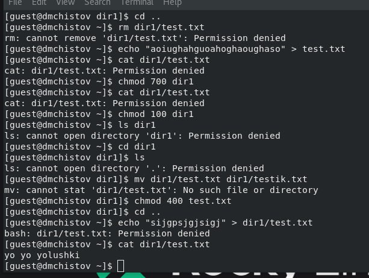{#fig:013 width=70%}

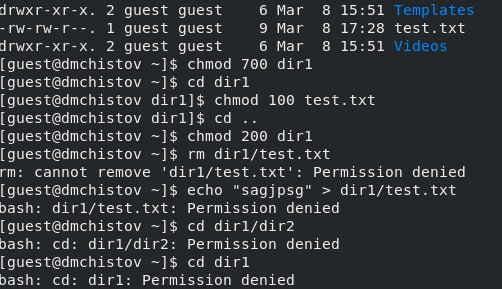{#fig:014 width=70%}

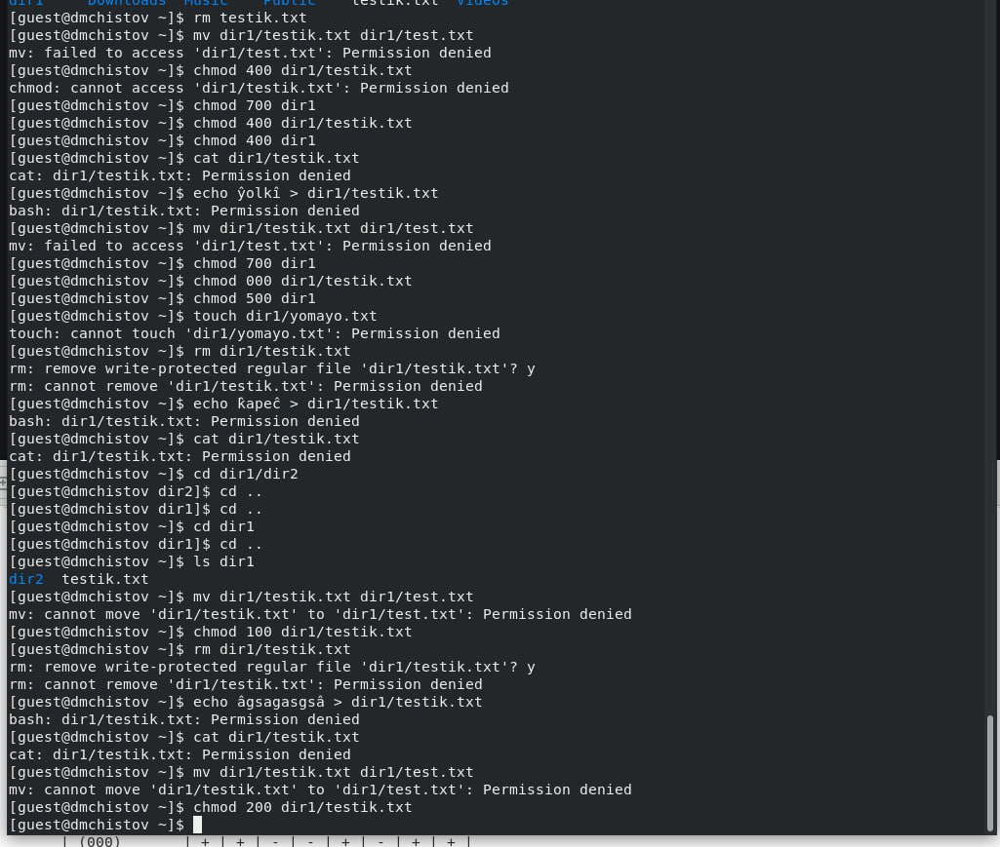{#fig:015 width=70%}

По итогу получилась вот такая таблица:

## Таблица 2.1 "Установленные права и разрешённые действия"

| Права директории | Права файла | Создание файла | Удаление файла | Запись в файл | Чтение файла | Смена директории | Просмотр файлов в директории | Переименование файла | Смена аттрибутов файла |
| :---             | :---        | :----: | :----: | :----: | :----: | :----: | :----: | :----: | :----: |
| d(000)           | (000)       | - | - | - | - | - | - | - | - |
| d(000)           | (100)       | - | - | - | - | - | - | - | - |
| d(000)           | (200)       | - | - | - | - | - | - | - | - |
| d(000)           | (300)       | - | - | - | - | - | - | - | - |
| d(000)           | (400)       | - | - | - | - | - | - | - | - |
| d(000)           | (500)       | - | - | - | - | - | - | - | - |
| d(000)           | (600)       | - | - | - | - | - | - | - | - |
| d(000)           | (700)       | - | - | - | - | - | - | - | - |
| d(100)           | (000)       | - | - | - | - | + | - | - | + |
| d(100)           | (100)       | - | - | - | - | + | - | - | + |
| d(100)           | (200)       | - | - | + | - | + | - | - | + |
| d(100)           | (300)       | - | - | + | - | + | - | - | + |
| d(100)           | (400)       | - | - | - | + | + | - | - | + |
| d(100)           | (500)       | - | - | - | + | + | - | - | + |
| d(100)           | (600)       | - | - | + | + | + | - | - | + |
| d(100)           | (700)       | - | - | + | + | + | - | - | + |
| d(200)           | (000)       | - | - | - | - | - | - | - | - |
| d(200)           | (100)       | - | - | - | - | - | - | - | - |
| d(200)           | (200)       | - | - | - | - | - | - | - | - |
| d(200)           | (300)       | - | - | - | - | - | - | - | - |
| d(200)           | (400)       | - | - | - | - | - | - | - | - |
| d(200)           | (500)       | - | - | - | - | - | - | - | - |
| d(200)           | (600)       | - | - | - | - | - | - | - | - |
| d(200)           | (700)       | - | - | - | - | - | - | - | - |
| d(300)           | (000)       | + | + | - | - | + | - | + | + |
| d(300)           | (100)       | + | + | - | - | + | - | + | + |
| d(300)           | (200)       | + | + | + | - | + | - | + | + |
| d(300)           | (300)       | + | + | + | - | + | - | + | + |
| d(300)           | (400)       | + | + | - | + | + | - | + | + |
| d(300)           | (500)       | + | + | - | + | + | - | + | + |
| d(300)           | (600)       | + | + | + | + | + | - | + | + |
| d(300)           | (700)       | + | + | + | + | + | - | + | + |
| d(400)           | (000)       | - | - | - | - | - | + | - | - |
| d(400)           | (100)       | - | - | - | - | - | + | - | - |
| d(400)           | (200)       | - | - | - | - | - | + | - | - |
| d(400)           | (300)       | - | - | - | - | - | + | - | - |
| d(400)           | (400)       | - | - | - | - | - | + | - | - |
| d(400)           | (500)       | - | - | - | - | - | + | - | - |
| d(400)           | (600)       | - | - | - | - | - | + | - | - |
| d(400)           | (700)       | - | - | - | - | - | + | - | - |
| d(500)           | (000)       | - | - | - | - | + | + | - | + |
| d(500)           | (100)       | - | - | - | - | + | + | - | + |
| d(500)           | (200)       | - | - | + | - | + | + | - | + |
| d(500)           | (300)       | - | - | + | - | + | + | - | + |
| d(500)           | (400)       | - | - | - | + | + | + | - | + |
| d(500)           | (500)       | - | - | - | + | + | + | - | + |
| d(500)           | (600)       | - | - | + | + | + | + | - | + |
| d(500)           | (700)       | - | - | + | + | + | + | - | + |
| d(600)           | (000)       | - | - | - | - | - | + | - | - |
| d(600)           | (100)       | - | - | - | - | - | + | - | - |
| d(600)           | (200)       | - | - | - | - | - | + | - | - |
| d(600)           | (300)       | - | - | - | - | - | + | - | - |
| d(600)           | (400)       | - | - | - | - | - | + | - | - |
| d(600)           | (500)       | - | - | - | - | - | + | - | - |
| d(600)           | (600)       | - | - | - | - | - | + | - | - |
| d(600)           | (700)       | - | - | - | - | - | + | - | - |
| d(700)           | (000)       | + | + | - | - | + | + | + | + |
| d(700)           | (100)       | + | + | - | - | + | + | + | + |
| d(700)           | (200)       | + | + | + | - | + | + | + | + |
| d(700)           | (300)       | + | + | + | - | + | + | + | + |
| d(700)           | (400)       | + | + | - | + | + | + | + | + |
| d(700)           | (500)       | + | + | - | + | + | + | + | + |
| d(700)           | (600)       | + | + | + | + | + | + | + | + |
| d(700)           | (700)       | + | + | + | + | + | + | + | + |

Опираясь на эту таблицу, я заполнил таблицу 2.2. Там просто требуется определить какие минимальные права нужны для файла и директории, чтобы выполнить ту или иную операцию. Заполнял просто определяя первую встретившуюся строчку, где стоит + для нужной мне операции, затем смотрел в ячейку с правами для директории и правами для файла.

В конце концов получилась вот такая таблица:

## Таблица 2.2 "Минимальные права для совершения операций"

| Операция               | Минимальные права на директорию | Минимальные права на файл |
| :---                   | :---                            | :---                      |
| Создание файла         | 300                             | 000                       |
| Удаление файла         | 300                             | 000                       |
| Чтение файла           | 100                             | 400                       |
| Запись в файл          | 100                             | 200                       |
| Переименование файла   | 300                             | 000                       |
| Создание поддиректории | 300                             | 000                       |
| Удаление поддиректории | 300                             | 000                       |

# Выводы

При выполнении данной лаборатоной работы я получил практические навыки работы в консоли с атрибутами файлов, закрепил теоретические основы дискреционного разграничения доступа в современных системах с открытым кодом на базе ОС Linux

# Список литературы

[Лабораторная работы №2](https://esystem.rudn.ru/pluginfile.php/2580592/mod_resource/content/6/002-lab_discret_attr.pdf)

