---
## Front matter
lang: ru-RU
title: Лабораторная работа №4
subtitle: Основы информационной безопасности
author:
  - Чистов Д. М.
institute:
  - Российский университет дружбы народов, Москва, Россия
  - Объединённый институт ядерных исследований, Дубна, Россия
date: 5 апреля 2025

## i18n babel
babel-lang: russian
babel-otherlangs: english

## Formatting pdf
toc: false
toc-title: Содержание
slide_level: 2
aspectratio: 169
section-titles: true
theme: metropolis
header-includes:
 - \metroset{progressbar=frametitle,sectionpage=progressbar,numbering=fraction}
---

# Цель работы

Получение практических навыков работы в консоли с расширенными
атрибутами файлов1

# Атрибуты файлов

На википедии нашёл таблицу атрибутов, в данной лабораторной работе я буду экспериментировать с атрибутов a (в файл можно только добавлять, но изменять его - удалять, переименовывать нельзя. Исключительно добавление новой информации) и с атрибутом i (файл никак нельзя изменять, immutable).

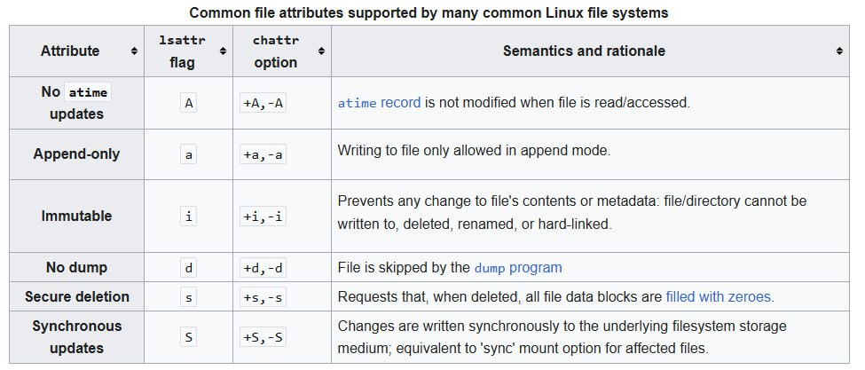{#fig:001 width=70%}

# Выполнение лабораторной работы

От имени пользователя guest определяю расширенные атрибуты файла.

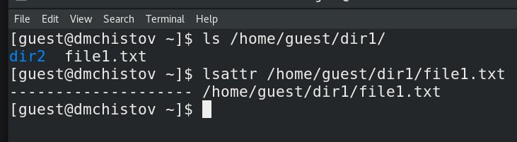{#fig:002 width=70%}

## Выполнение лабораторной работы

Командой chmod 600 устанавливаю на наш файл права на чтение и запись для владельца файла.

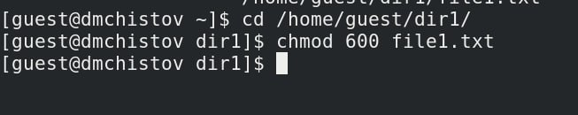{#fig:003 width=70%}

## Выполнение лабораторной работы

От пользователя guest пытаюсь установаить расширенные атрибут a, но получаю ошибку.

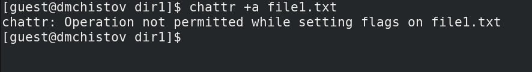{#fig:004 width=70%}

## Выполнение лабораторной работы

Поэтому в другой консоли, с root правами, устанавливаю данный расширенный атрибут.

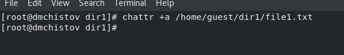{#fig:005 width=70%}

## Выполнение лабораторной работы

Аттрибут успешно установлен, проверил от имени пользователя guest.

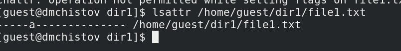{#fig:006 width=70%}

## Выполнение лабораторной работы

Выполняю запись в файл командой echo, затем проверяю, что текст появился в файле.

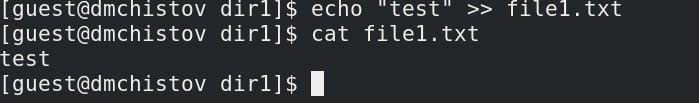{#fig:007 width=70%}

## Выполнение лабораторной работы

Теперь пробую перезаписать текст в файле, удалить файл, переименовать файл, всё безуспешно.

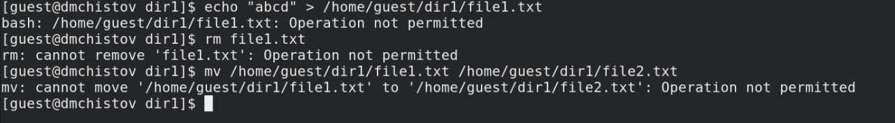{#fig:008 width=70%}

## Выполнение лабораторной работы

Также не получилось снять права с файла.

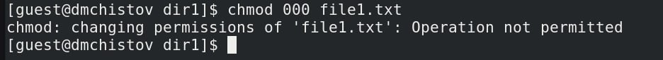{#fig:009 width=70%}

## Выполнение лабораторной работы

После я убрал атрибут a командой chattr -a, все операции, в которые мне не удавалось выполнить, теперь спокойно выполняются.

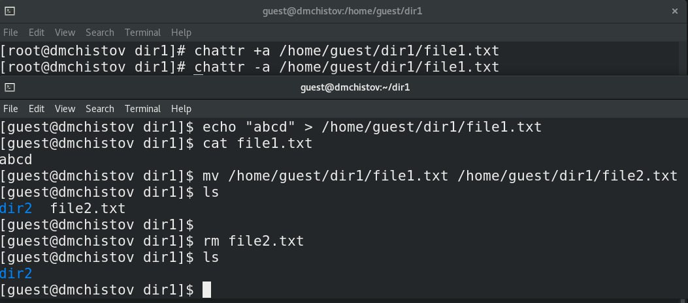{#fig:010 width=70%}

## Выполнение лабораторной работы

Теперь проделаю тоже самое, но с атрибутом i, создам файл и поставлю ему данный атрибут.

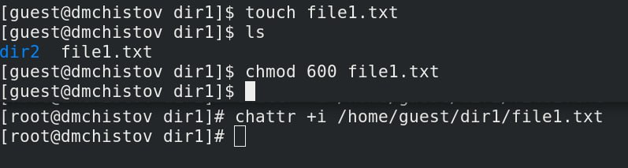{#fig:011 width=70%}

## Выполнение лабораторной работы

В этот раз не получилось даже записать новую информацию в файл, не говоря уже и о тех же самых операциях, которые не удавалось выполнять с файлом с атрибутом a.

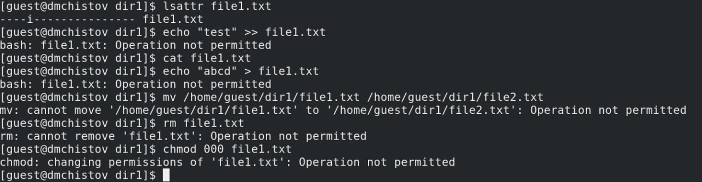{#fig:012 width=70%}

## Выполнение лабораторной работы

Без атрибута i, всё успешно работает.

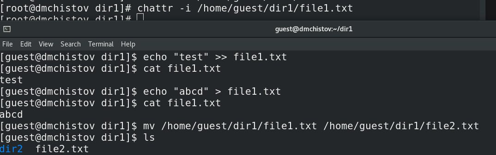{#fig:013 width=70%}

# Выводы

В результате выполнения работы я повысил свои навыки использования интерфейса командой строки (CLI), познакомился на примерах с тем, как используются основные и расширенные атрибуты при разграничении доступа. Опробовал действие на практике расширенных атрибутов «а» и «i»

# Список литературы

[Лабораторная работы №4](https://esystem.rudn.ru/pluginfile.php/2580596/mod_resource/content/3/004-lab_discret_extattr.pdf)

[Аттрибуты файлов](https://en.wikipedia.org/wiki/File_attribute)

