---
## Front matter
title: "Отчёт по лабораторной работе №4"
subtitle: "Основы информационной безопасности"
author: "Чистов Даниил Максимович"

## Generic otions
lang: ru-RU
toc-title: "Содержание"

## Bibliography
bibliography: bib/cite.bib
csl: pandoc/csl/gost-r-7-0-5-2008-numeric.csl

## Pdf output format
toc: true # Table of contents
toc-depth: 2
lof: true # List of figures
lot: false # List of tables
fontsize: 12pt
linestretch: 1.5
papersize: a4
documentclass: scrreprt
## I18n polyglossia
polyglossia-lang:
  name: russian
  options:
	- spelling=modern
	- babelshorthands=true
polyglossia-otherlangs:
  name: english
## I18n babel
babel-lang: russian
babel-otherlangs: english
## Fonts
mainfont: IBM Plex Serif
romanfont: IBM Plex Serif
sansfont: IBM Plex Sans
monofont: IBM Plex Mono
mathfont: STIX Two Math
mainfontoptions: Ligatures=Common,Ligatures=TeX,Scale=0.94
romanfontoptions: Ligatures=Common,Ligatures=TeX,Scale=0.94
sansfontoptions: Ligatures=Common,Ligatures=TeX,Scale=MatchLowercase,Scale=0.94
monofontoptions: Scale=MatchLowercase,Scale=0.94,FakeStretch=0.9
mathfontoptions:
## Biblatex
biblatex: true
biblio-style: "gost-numeric"
biblatexoptions:
  - parentracker=true
  - backend=biber
  - hyperref=auto
  - language=auto
  - autolang=other*
  - citestyle=gost-numeric
## Pandoc-crossref LaTeX customization
figureTitle: "Рис."
tableTitle: "Таблица"
listingTitle: "Листинг"
lofTitle: "Список иллюстраций"
lotTitle: "Список таблиц"
lolTitle: "Листинги"
## Misc options
indent: true
header-includes:
  - \usepackage{indentfirst}
  - \usepackage{float} # keep figures where there are in the text
  - \floatplacement{figure}{H} # keep figures where there are in the text
---

# Цель работы

Получение практических навыков работы в консоли с расширенными
атрибутами файлов1

# Атрибуты файлов

На википедии нашёл таблицу атрибутов, в данной лабораторной работе я буду экспериментировать с атрибутов a (в файл можно только добавлять, но изменять его - удалять, переименовывать нельзя. Исключительно добавление новой информации) и с атрибутом i (файл никак нельзя изменять, immutable) (рис. [-@fig:001]).

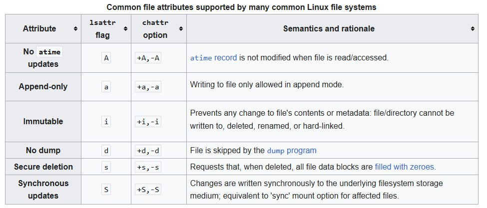{#fig:001 width=70%}

# Выполнение лабораторной работы

От имени пользователя guest определяю расширенные атрибуты файла (рис. [-@fig:002]).

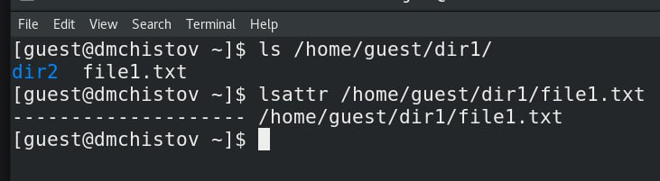{#fig:002 width=70%}

Командой chmod 600 устанавливаю на наш файл права на чтение и запись для владельца файла (рис. [-@fig:003]).

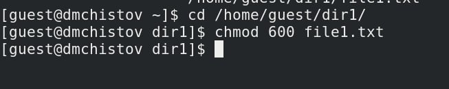{#fig:003 width=70%}

От пользователя guest пытаюсь установаить расширенные атрибут a, но получаю ошибку (рис. [-@fig:004]).

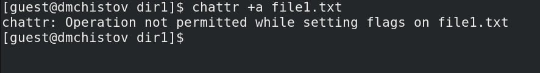{#fig:004 width=70%}

Поэтому в другой консоли, с root правами, устанавливаю данный расширенный атрибут (рис. [-@fig:005]).

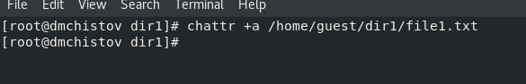{#fig:005 width=70%}

Аттрибут успешно установлен, проверил от имени пользователя guest (рис. [-@fig:006]).

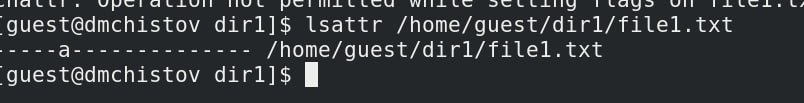{#fig:006 width=70%}

Выполняю запись в файл командой echo, затем проверяю, что текст появился в файле (рис. [-@fig:007]).

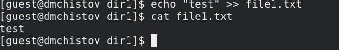{#fig:007 width=70%}

Теперь пробую перезаписать текст в файле, удалить файл, переименовать файл, всё безуспешно (рис. [-@fig:008]).

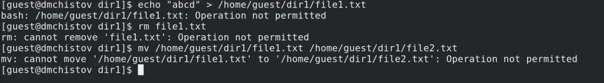{#fig:008 width=70%}

Также не получилось снять права с файла (рис. [-@fig:009]).

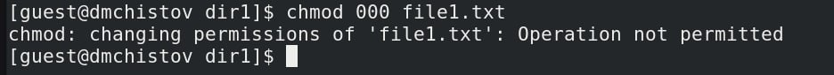{#fig:009 width=70%}

После я убрал атрибут a командой chattr -a, все операции, в которые мне не удавалось выполнить, теперь спокойно выполняются (рис. [-@fig:010]).

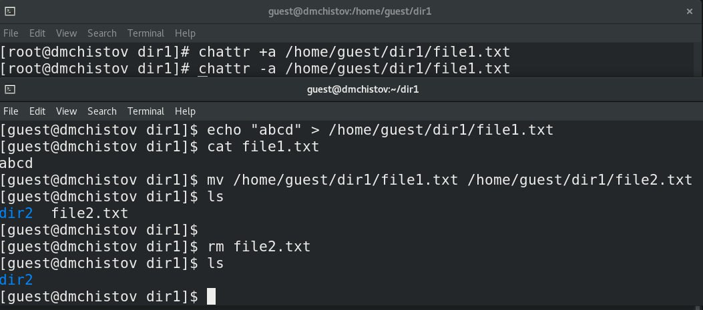{#fig:010 width=70%}

Теперь проделаю тоже самое, но с атрибутом i, создам файл и поставлю ему данный атрибут (рис. [-@fig:011]).

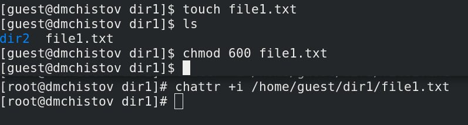{#fig:011 width=70%}

В этот раз не получилось даже записать новую информацию в файл, не говоря уже и о тех же самых операциях, которые не удавалось выполнять с файлом с атрибутом a (рис. [-@fig:012]).

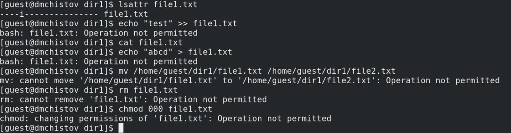{#fig:012 width=70%}

Без атрибута i, всё успешно работает (рис. [-@fig:013]).

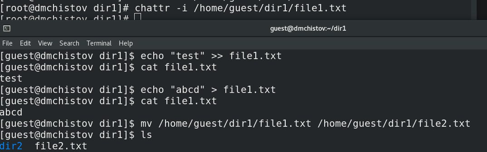{#fig:013 width=70%}

# Выводы

В результате выполнения работы я повысил свои навыки использования интерфейса командой строки (CLI), познакомился на примерах с тем, как используются основные и расширенные атрибуты при разграничении доступа. Опробовал действие на практике расширенных атрибутов «а» и «i»

# Список литературы

[Лабораторная работы №4](https://esystem.rudn.ru/pluginfile.php/2580596/mod_resource/content/3/004-lab_discret_extattr.pdf)

[Аттрибуты файлов](https://en.wikipedia.org/wiki/File_attribute)
