---
## Front matter
lang: ru-RU
title: Лабораторная работа №5
subtitle: Основы информационной безопасности
author:
  - Чистов Д. М.
institute:
  - Российский университет дружбы народов, Москва, Россия
  - Объединённый институт ядерных исследований, Дубна, Россия
date: 19 апреля 2025

## i18n babel
babel-lang: russian
babel-otherlangs: english

## Formatting pdf
toc: false
toc-title: Содержание
slide_level: 2
aspectratio: 169
section-titles: true
theme: metropolis
header-includes:
 - \metroset{progressbar=frametitle,sectionpage=progressbar,numbering=fraction}
---

# Цель работы

Целью данной лабораторной работы является изучение механизмов изменения идентификаторов, применения SetUID- и Sticky-битов. Получение практических навыков работы в консоли с дополнительными атрибутами. Рассмотрение работы механизма смены идентификатора процессов пользователей, а также влияние бита Sticky на запись и удаление файлов

## Задание

1. Исследование SetUID и SetGID битов
2. Исследование Sticky-битов

# Выполнение лабораторной работы

## Подготовка к лабораторной работы

Перед выполнение требуется выяснить, установлен ли компилятор gcc. Всё установлено. Также нужно отключить систему запретов командой setenforce 0, после чего вывод команды getenforce становится "Permissive".

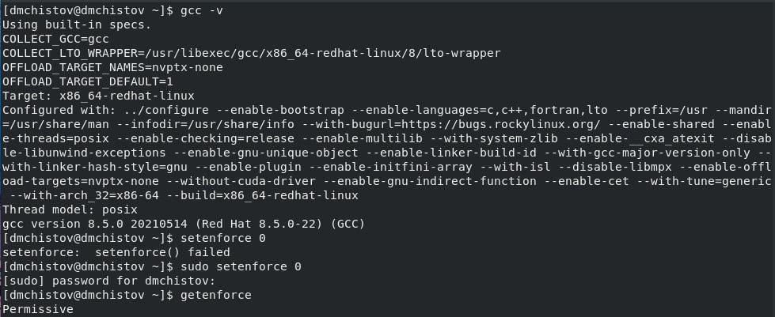{#fig:001 width=70%}

## Исследование SetUID и SetGID битов

Вхожу в систему как пользователь guest и создаю файл simpleid.c.

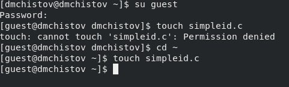{#fig:002 width=70%}

## Исследование SetUID и SetGID битов

Вставляю в файл код из задания, компилирую, запускаю, после чего прописываю команду id и сравниваю результаты. Всё сходится.

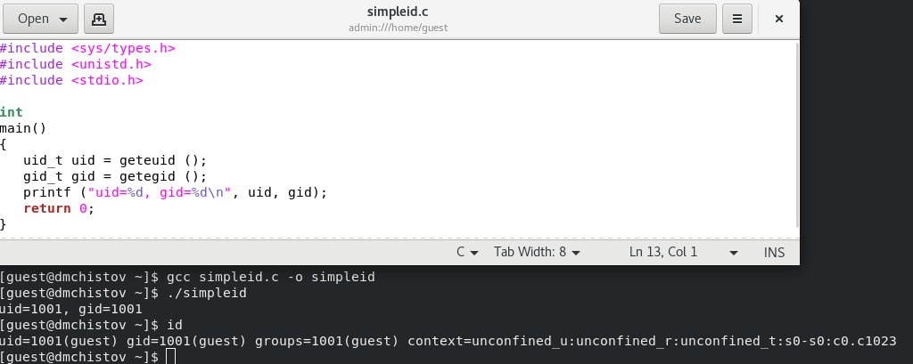{#fig:003 width=70%}

## Исследование SetUID и SetGID битов

Усложняю программу, вставив новый код из задания, сохраняю файл как simpleid2.c, компилирую и запускаю.

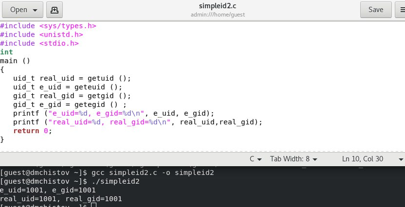{#fig:004 width=70%}

## Исследование SetUID и SetGID битов

Прописываю в консоль следующие команды, как на скриншоте ниже.

Первая комнада меняет владельца файла на root. Теперь суперпользователь является владельцем файла. Вторая команда устанавливает SetUID-бит, т.е. программа будет запускаться от имени владельца файла, а не от того, кто её запустил.

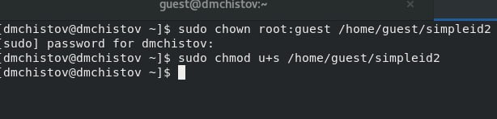{#fig:005 width=70%}

## Исследование SetUID и SetGID битов

В предисловии к данной лабораторной работе сказано: "любая bash-программа интерпретируется в процессе своего выполнения, т.е. существует сторонняя программа-интерпретатор, которая выполняет считывание файла сценария и выполняет его последовательно. Сам интерпретатор выполняется с правами пользователя, его запустившего, а значит, и выполняемая программа использует эти права."

## Исследование SetUID и SetGID битов

Проверяю правильно ли установились новые атрибуты и сменился ли владелец у программы simpleid2 - всё верно.

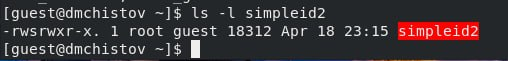{#fig:006 width=70%}

## Исследование SetUID и SetGID битов

Теперь запускаю simpleid2 и id, сравниваю результат. e_uid стал равен 0 при выполнении программмы simpleid2.

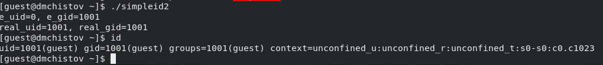{#fig:007 width=70%}

## Исследование SetUID и SetGID битов

Тоже самое проделываю относительно SetGID-бит, т.е. в этот раз пишу не chmod u+s, а chmod g+s.

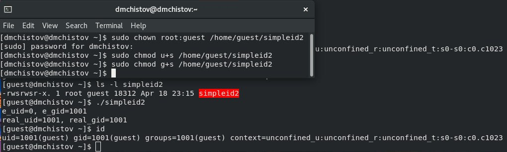{#fig:008 width=70%}

## Исследование SetUID и SetGID битов

Создаю новую программу readfile.c, беру код из задания, компилирую программу.

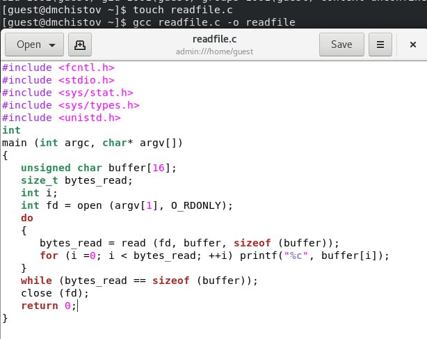{#fig:009 width=70%}

## Исследование SetUID и SetGID битов

Делаю так, чтобы только суперпользователь мог читать файл readfile.c, а guest не мог. Также изменяю владельца этого файла. На скриншоте ниже видно, как в нижней консоли, пользователь guest не может прочитать этот файл.

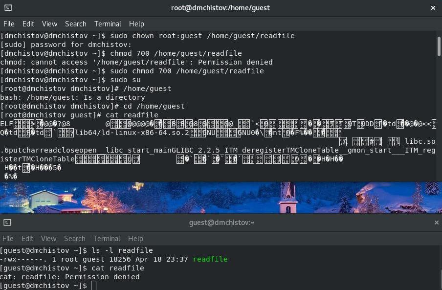{#fig:010 width=70%}

## Исследование SetUID и SetGID битов

Теперь меняю владельца у скомпилированной программы readfile и устанавливаю SetUID-бит. Проверяю, может ли наша программа прочитать файл readfile.c. Если запускать её в консоли суперпользователя, то она, естественно всё прочитает.

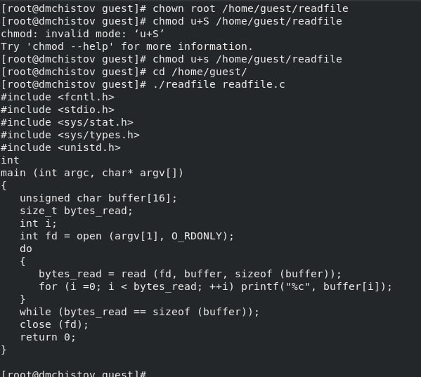{#fig:011 width=70%}

## Исследование SetUID и SetGID битов

Однако, если запустить её в консоли пользователя guest, то нам выдают сообщение об ошибке - недостаточно прав.

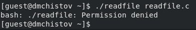{#fig:012 width=70%}

## Исследование SetUID и SetGID битов

Аналогичная ситуация происходит при попытке прочесть /etc/shadow.

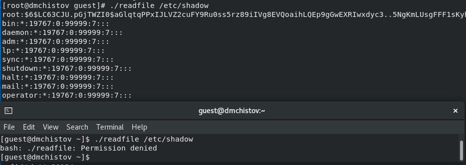{#fig:013 width=70%}

## Исследование Sticky-битов

Выясняю, установлен ли sticky-бит на директорию /tmp. Да, установлен, т.к. в конце сть буква t.

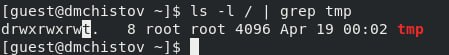{#fig:014 width=70%}

## Исследование Sticky-битов

От имени пользователя guest создаю файл file01.txt со словом "test", затем разрешаю чтение и запись для категории пользователей "все остальные" для данного файла.

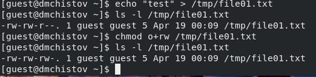{#fig:015 width=70%}

## Исследование Sticky-битов

От пользователя guest2 пытаюсь прочитать файл, дозаписать в него слово и перписать его полностью. Всё работает, следовательно мы успешно установили атрибуты в прошлом шаге.

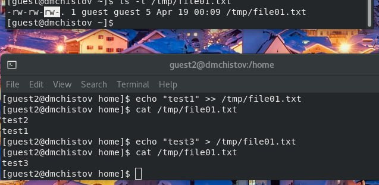{#fig:016 width=70%}

## Исследование Sticky-битов

Однако, удалить этот файл от лица guest2 не получается.

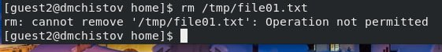{#fig:017 width=70%}

## Исследование Sticky-битов

От лица суперпользователя снимаю атрибут t (Sticky-бит) с директории /tmp, после чего командой "ls -l / | grep tmp" проверяю, что атрибута t действительно больше нет.

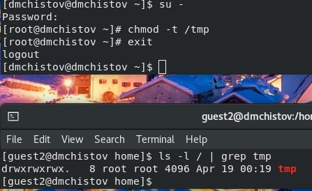{#fig:018 width=70%}

## Исследование Sticky-битов

Пытаюсь повторить все предыдущие шаги. Guest2 до сих пор может прочитать файл, дозаписать в него что-либо, переписать его, но теперь он также может его удалить, благодаря тому, что мы сняли атрибут t с папки, в которой лежит этот файл.

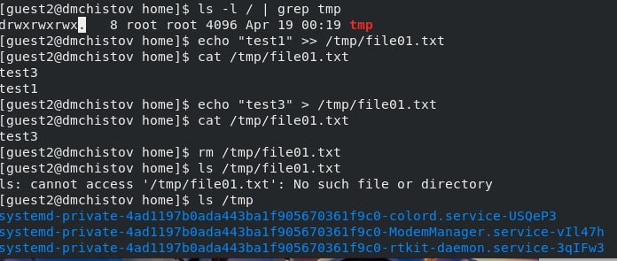{#fig:019 width=70%}

## Исследование Sticky-битов

Папка tmp довольно важна, поэтому лучше атрибут t вернуть на место, после наших экспериментов.

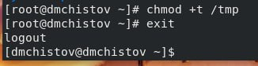{#fig:020 width=70%}

# Выводы

В результате выполнения данной лабораторной работы я изучил механизмы изменения идентификаторов, применение SetUID- и Sticky-битов. Получил практические навыки работы в консоли с дополнительными атрибутами. Рассмотрел работы механизма смены идентификатора процессов пользователей, а также влияние бита Sticky на запись и удаление файлов

# Список литературы

[Лабораторная работа №5](https://esystem.rudn.ru/pluginfile.php/2580598/mod_resource/content/2/005-lab_discret_sticky.pdf)

