---
## Front matter
lang: ru-RU
title: Лабораторная работа №6
subtitle: Основы информационной безопасности
author:
  - Чистов Д. М.
institute:
  - Российский университет дружбы народов, Москва, Россия
  - Объединённый институт ядерных исследований, Дубна, Россия
date: 03 мая 2025

## i18n babel
babel-lang: russian
babel-otherlangs: english

## Formatting pdf
toc: false
toc-title: Содержание
slide_level: 2
aspectratio: 169
section-titles: true
theme: metropolis
header-includes:
 - \metroset{progressbar=frametitle,sectionpage=progressbar,numbering=fraction}
---

## Цель работы

Целью данной лабораторной работы является развитие навыков администрирования ОС Linux, получение первого практического знакомства с технологией SELinux, проверка работы SELinux на практике совместно с веб-сервером Apache.

# Выполнение лабораторной работы

Вхожу в систему, убеждаюсь командой sestatus, что SELinux работает в режиме enforcing политики targeted.

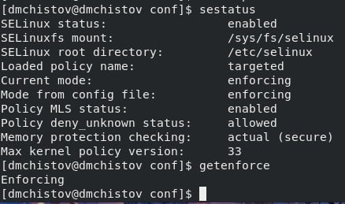{#fig:001 width=70%}

## Выполнение лабораторной работы

Командой service httpd status убеждаюсь, что веб-сервер Apache работает.

{#fig:002 width=70%}

## Выполнение лабораторной работы

Командой ps auxZ | grep httpd нахожу процессы веб-сервера Apache и определяю его контекст безопасности - httpd_t.

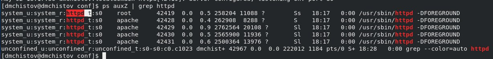{#fig:003 width=70%}

## Выполнение лабораторной работы

Командой sestatus -b | grep httpd смотрю текущее состояние переключателей SELinux для Apaceh, действительно большинство из них в положении "off".

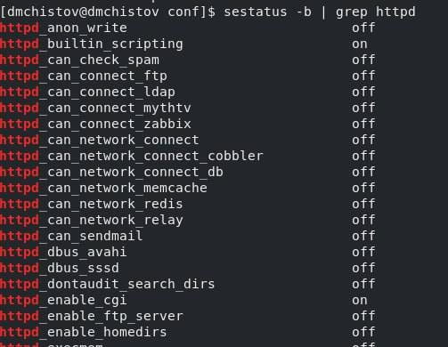{#fig:004 width=70%}

## Выполнение лабораторной работы

Командой seinfo смотрю статистику по политике - вижу, что типов 5015, пользователей - 8, ролей - 15.

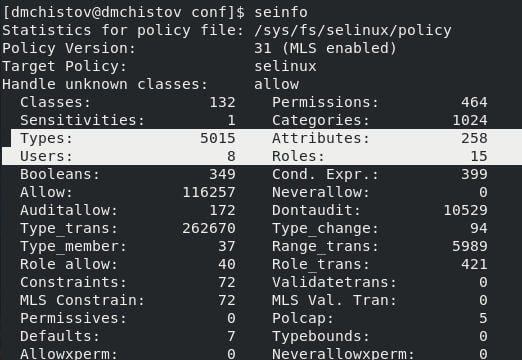{#fig:005 width=70%}

## Выполнение лабораторной работы

Определяю тип файлов и поддиректорий в /var/www, там лежат файлы Apache типа.

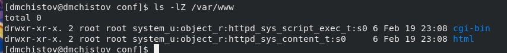{#fig:006 width=70%}

## Выполнение лабораторной работы

Определяю тип файлов в /var/www/html - нету никаких файлов, также определяю круг пользователей, которым разрешено создание файлов этой директории - только root пользователь на такое способен.

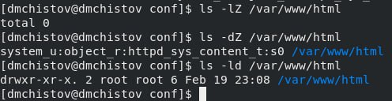{#fig:007 width=70%}

## Выполнение лабораторной работы

От имени суперпользователя создаю html файл test.html - простая веб-страница с текстом - test.

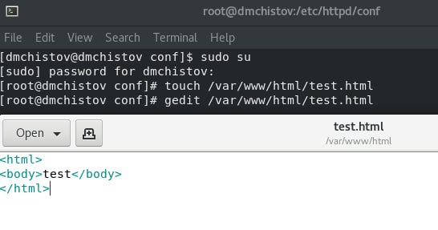{#fig:008 width=70%}

## Выполнение лабораторной работы

Проверяю созданный мною файл на контекст - httpd - для Apache.

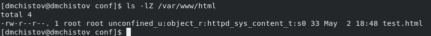{#fig:009 width=70%}

## Выполнение лабораторной работы

Через браузер захожу на эту веб-страничку и вижу соответствующий текст.

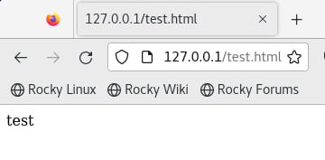{#fig:010 width=70%}

## Выполнение лабораторной работы

Командой ls -Z /var/www/html/test.html проверяю контекст этого файла - httpd_sys_content_t (такой тип позволяет httpd получить доступ к файлу, поэтому мы можем его открыть через браузер) с unconfined_u (свободный пользователей).

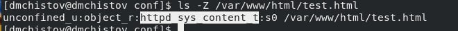{#fig:011 width=70%}

## Выполнение лабораторной работы

Меняю контекст этого файла с httpd_sys_content_t на, например, samra_share_t.

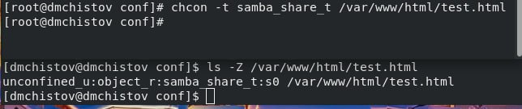{#fig:012 width=70%}

## Выполнение лабораторной работы

Пытаюсь заново обратиться к веб-странице через браузер и получаю отказ.

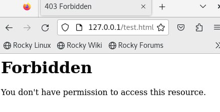{#fig:013 width=70%}

## Выполнение лабораторной работы

Смотрю лог файлы сервера Apache и пытаюсь разобраться что не так - думаю, дело в том, что мы поменяли тип файла несколькими шагами ранее. Как минимум в логах нас просят поставить какой-то тип данному файлу.

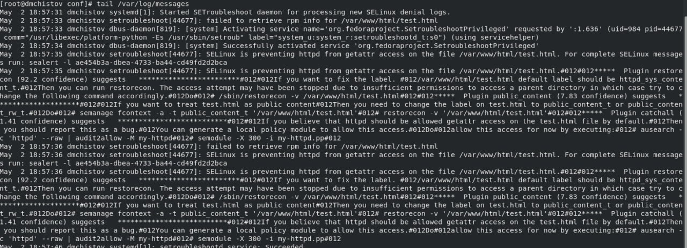{#fig:014 width=70%}

## Выполнение лабораторной работы

Запускаю веб-сервер Apache на прослушивании TCP-порта 81, а не 80 - заменяю строку в конфиг файле веб-сервера.

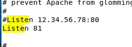{#fig:015 width=70%}

## Выполнение лабораторной работы

Теперь после перезапуска мне не просто отказано в доступе, а сама страничка уже не грузится.

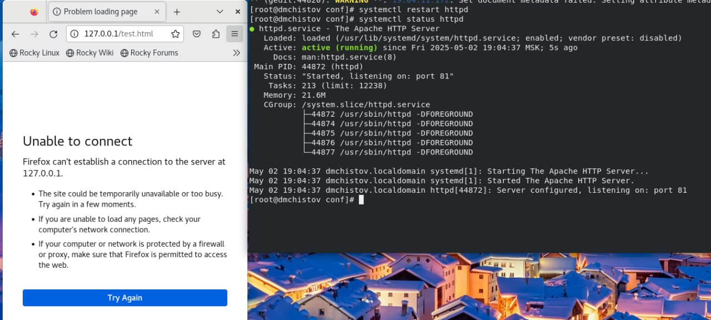{#fig:016 width=70%}

## Выполнение лабораторной работы

Смотрю лог файлы - сервер прослушивает порт 81.

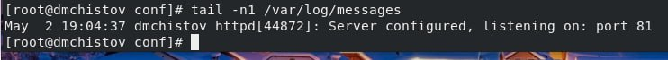{#fig:017 width=70%}

## Выполнение лабораторной работы

Смотрю другие лог файлы, вижу, что мне говорят об отсутствии прав.

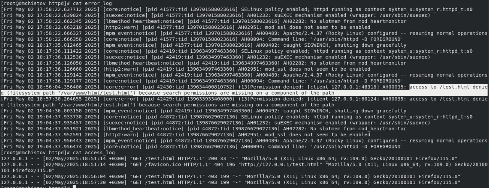{#fig:018 width=70%}

## Выполнение лабораторной работы

Командой semanage port -a -t http_port_t -p tcp 81 добавляю порт 81, затем смотрю появился ли он - конечно появился.

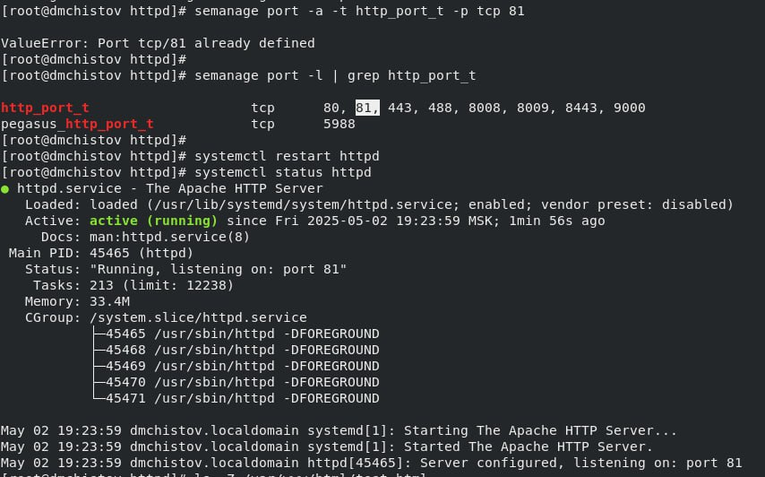{#fig:019 width=70%}

## Выполнение лабораторной работы

Перезапускаю веб-сервер Apache - всё успешно, нам нужно было объявить ему о новом порте 81, т.к. его не было в списке, а конфиге мы поставили прослушивание этого на тот момент отсутствующего порта. Затем возвращаю нашей веб-страничке необходимый её тип httpd_sys_content_t и через браузер обращаюсь к той же веб-страничке, но через порт 81 (http://127.0.0.1:81/test.html) - всё работает - текст виден.

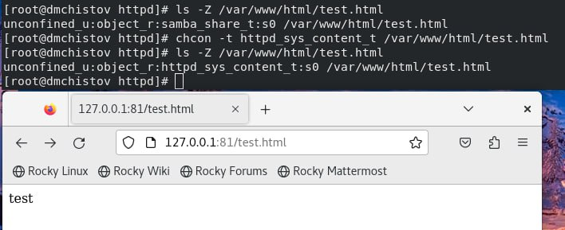{#fig:020 width=70%}

## Выполнение лабораторной работы

Завершаю работу - удаляю привзяку к порту 81, а также удаляю созданный нами файл test.html.

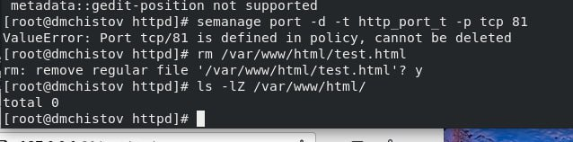{#fig:021 width=70%}

# Выводы

В результате выполнения данной лабораторной работы я развил навыки администрирования ОС Linux. Получил первое практическое знакомство с технологией SELinux, проверил работу SELinux на практике совместно с веб-сервером Apache.

# Список литературы

[Лабораторная работа №6](https://esystem.rudn.ru/pluginfile.php/2580600/mod_resource/content/2/006-lab_selinux.pdf)
