---
## Front matter
title: "Лабораторная работа №6"
subtitle: "Основы Информационной Безопасности"
author: "Чистов Даниил Максимович"

## Generic otions
lang: ru-RU
toc-title: "Содержание"

## Bibliography
bibliography: bib/cite.bib
csl: pandoc/csl/gost-r-7-0-5-2008-numeric.csl

## Pdf output format
toc: true # Table of contents
toc-depth: 2
lof: true # List of figures
lot: false # List of tables
fontsize: 12pt
linestretch: 1.5
papersize: a4
documentclass: scrreprt
## I18n polyglossia
polyglossia-lang:
  name: russian
  options:
	- spelling=modern
	- babelshorthands=true
polyglossia-otherlangs:
  name: english
## I18n babel
babel-lang: russian
babel-otherlangs: english
## Fonts
mainfont: IBM Plex Serif
romanfont: IBM Plex Serif
sansfont: IBM Plex Sans
monofont: IBM Plex Mono
mathfont: STIX Two Math
mainfontoptions: Ligatures=Common,Ligatures=TeX,Scale=0.94
romanfontoptions: Ligatures=Common,Ligatures=TeX,Scale=0.94
sansfontoptions: Ligatures=Common,Ligatures=TeX,Scale=MatchLowercase,Scale=0.94
monofontoptions: Scale=MatchLowercase,Scale=0.94,FakeStretch=0.9
mathfontoptions:
## Biblatex
biblatex: true
biblio-style: "gost-numeric"
biblatexoptions:
  - parentracker=true
  - backend=biber
  - hyperref=auto
  - language=auto
  - autolang=other*
  - citestyle=gost-numeric
## Pandoc-crossref LaTeX customization
figureTitle: "Рис."
tableTitle: "Таблица"
listingTitle: "Листинг"
lofTitle: "Список иллюстраций"
lotTitle: "Список таблиц"
lolTitle: "Листинги"
## Misc options
indent: true
header-includes:
  - \usepackage{indentfirst}
  - \usepackage{float} # keep figures where there are in the text
  - \floatplacement{figure}{H} # keep figures where there are in the text
---

# Цель работы

Целью данной лабораторной работы является развитие навыков администрирования ОС Linux, получение первого практического знакомства с технологией SELinux, проверка работы SELinux на практике совместно с веб-сервером Apache.

# Выполнение лабораторной работы

Вхожу в систему, убеждаюсь командой sestatus, что SELinux работает в режиме enforcing политики targeted (рис. [-@fig:001]).

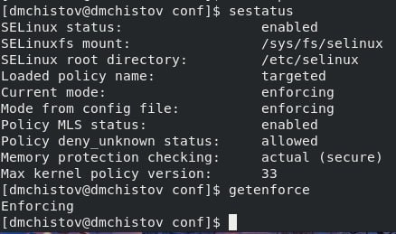{#fig:001 width=70%}a

Командой service httpd status убеждаюсь, что веб-сервер Apache работает (рис. [-@fig:002]).

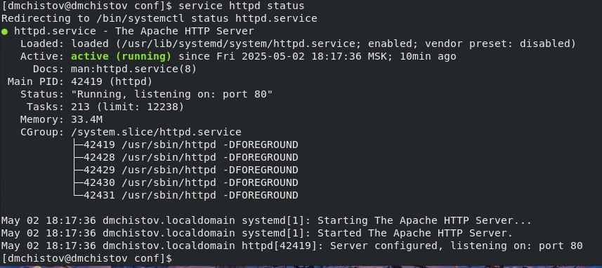{#fig:002 width=70%}

Командой ps auxZ | grep httpd нахожу процессы веб-сервера Apache и определяю его контекст безопасности - httpd_t (рис. [-@fig:003]).

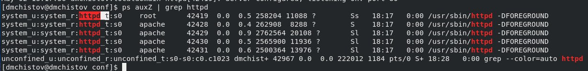{#fig:003 width=70%}

Командой sestatus -b | grep httpd смотрю текущее состояние переключателей SELinux для Apaceh, действительно большинство из них в положении "off" (рис. [-@fig:004]).

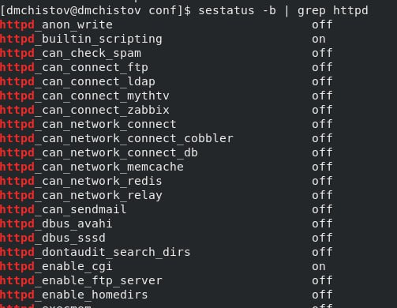{#fig:004 width=70%}

Командой seinfo смотрю статистику по политике - вижу, что типов 5015, пользователей - 8, ролей - 15 (рис. [-@fig:005]).

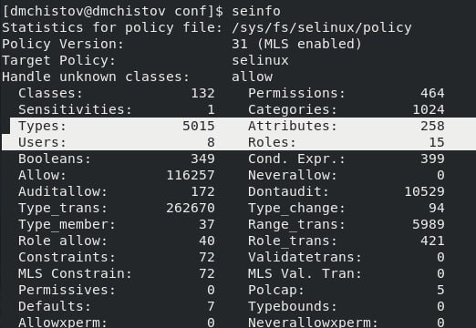{#fig:005 width=70%}

Определяю тип файлов и поддиректорий в /var/www, там лежат файлы Apache типа (рис. [-@fig:006]).

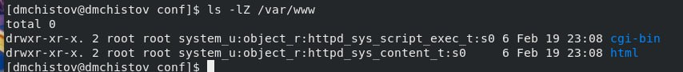{#fig:006 width=70%}

Определяю тип файлов в /var/www/html - нету никаких файлов, также определяю круг пользователей, которым разрешено создание файлов этой директории - только root пользователь на такое способен (рис. [-@fig:007]).

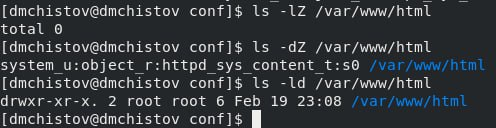{#fig:007 width=70%}

От имени суперпользователя создаю html файл test.html - простая веб-страница с текстом - test (рис. [-@fig:008]).

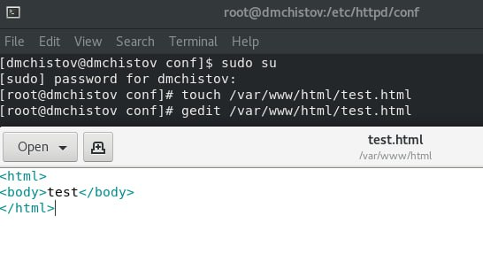{#fig:008 width=70%}

Проверяю созданный мною файл на контекст - httpd - для Apache (рис. [-@fig:009]).

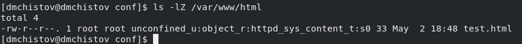{#fig:009 width=70%}

Через браузер захожу на эту веб-страничку и вижу соответствующий текст (рис. [-@fig:010]).

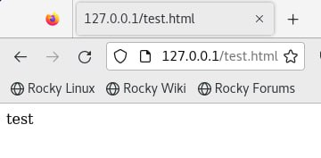{#fig:010 width=70%}

Командой ls -Z /var/www/html/test.html проверяю контекст этого файла - httpd_sys_content_t (такой тип позволяет httpd получить доступ к файлу, поэтому мы можем его открыть через браузер) с unconfined_u (свободный пользователей) (рис. [-@fig:011]).

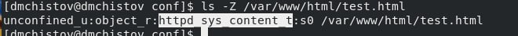{#fig:011 width=70%}

Меняю контекст этого файла с httpd_sys_content_t на, например, samra_share_t (рис. [-@fig:012]).

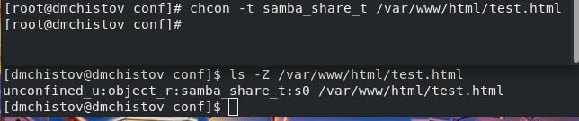{#fig:012 width=70%}

Пытаюсь заново обратиться к веб-странице через браузер и получаю отказ (рис. [-@fig:013]).

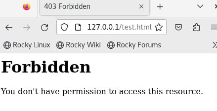{#fig:013 width=70%}

Смотрю лог файлы сервера Apache и пытаюсь разобраться что не так - думаю, дело в том, что мы поменяли тип файла несколькими шагами ранее. Как минимум в логах нас просят поставить какой-то тип данному файлу (рис. [-@fig:014]).

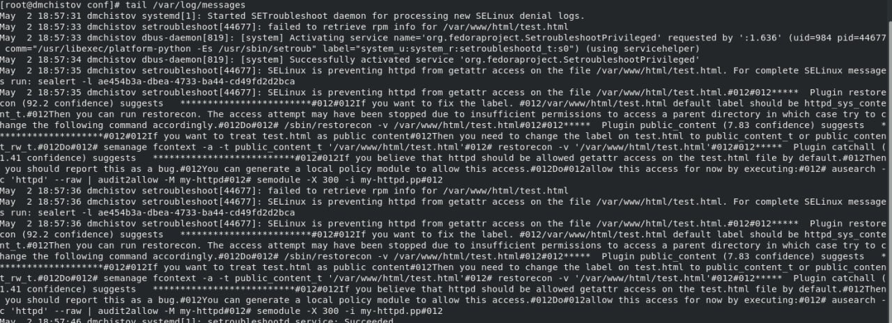{#fig:014 width=70%}

Запускаю веб-сервер Apache на прослушивании TCP-порта 81, а не 80 - заменяю строку в конфиг файле веб-сервера (рис. [-@fig:015]).

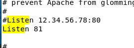{#fig:015 width=70%}

Теперь после перезапуска мне не просто отказано в доступе, а сама страничка уже не грузится (рис. [-@fig:016]).

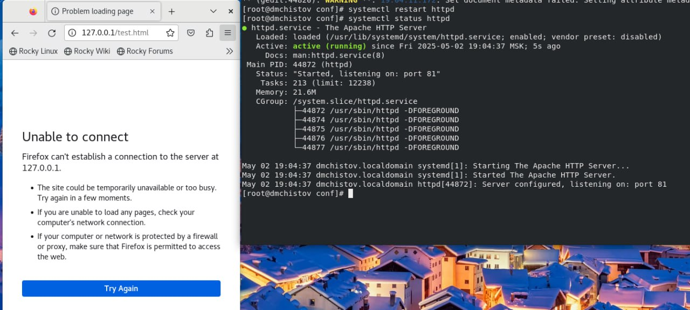{#fig:016 width=70%}

Смотрю лог файлы - сервер прослушивает порт 81 (рис. [-@fig:017]).

{#fig:017 width=70%}

Смотрю другие лог файлы, вижу, что мне говорят об отсутствии прав (рис. [-@fig:018]).

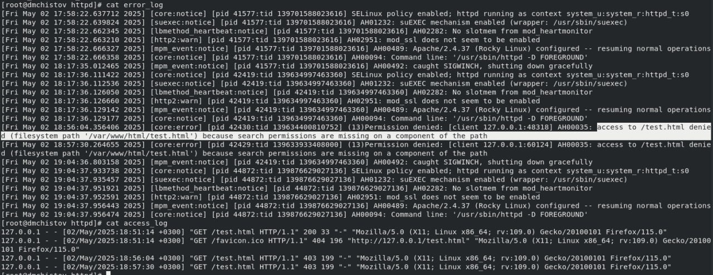{#fig:018 width=70%}

Командой semanage port -a -t http_port_t -p tcp 81 добавляю порт 81, затем смотрю появился ли он - конечно появился (рис. [-@fig:019]).

{#fig:019 width=70%}

Перезапускаю веб-сервер Apache - всё успешно, нам нужно было объявить ему о новом порте 81, т.к. его не было в списке, а конфиге мы поставили прослушивание этого на тот момент отсутствующего порта. Затем возвращаю нашей веб-страничке необходимый её тип httpd_sys_content_t и через браузер обращаюсь к той же веб-страничке, но через порт 81 (http://127.0.0.1:81/test.html) - всё работает - текст виден (рис. [-@fig:020]).

{#fig:020 width=70%}

Завершаю работу - удаляю привзяку к порту 81, а также удаляю созданный нами файл test.html (рис. [-@fig:021]).

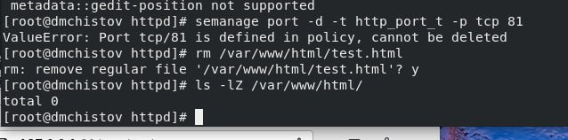{#fig:021 width=70%}

# Выводы

В результате выполнения данной лабораторной работы я развил навыки администрирования ОС Linux. Получил первое практическое знакомство с технологией SELinux, проверил работу SELinux на практике совместно с веб-сервером Apache.

# Список литературы

[Лабораторная работа №6](https://esystem.rudn.ru/pluginfile.php/2580600/mod_resource/content/2/006-lab_selinux.pdf)
