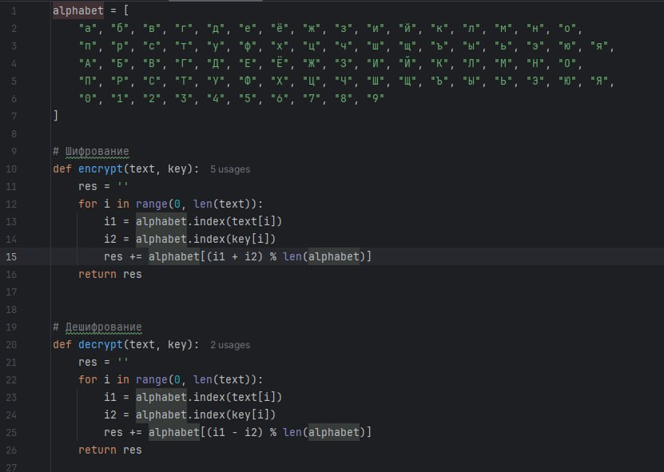
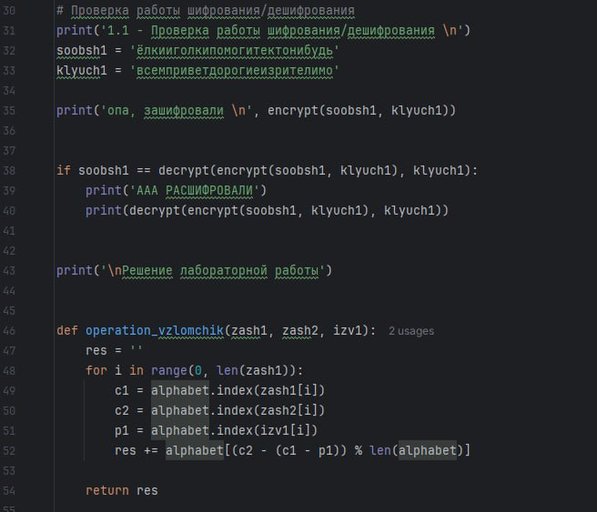
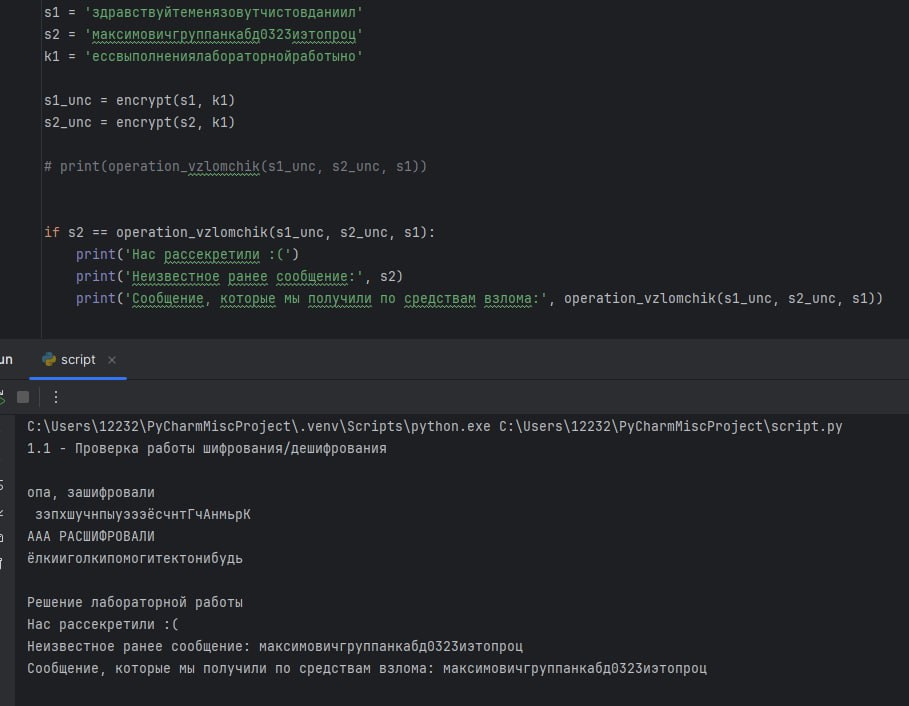

---
## Front matter
lang: ru-RU
title: Лабораторная работа №8
subtitle: Основы информационной безопасности
author:
  - Чистов Д. М.
institute:
  - Российский университет дружбы народов, Москва, Россия
  - Объединённый институт ядерных исследований, Дубна, Россия
date: 31 мая 2025

## i18n babel
babel-lang: russian
babel-otherlangs: english

## Formatting pdf
toc: false
toc-title: Содержание
slide_level: 2
aspectratio: 169
section-titles: true
theme: metropolis
header-includes:
 - \metroset{progressbar=frametitle,sectionpage=progressbar,numbering=fraction}
---

# Цель работы

Освоить на практике применение режима однократного гаммирования на примере кодирования различных исходных текстов одним ключом

## Выполнение лабораторной работы

Требуется написать программу, которая сможет получить расшифрованное сообщение 2, зная только оба зашифрованных сообщения и расшифрованное сообщение 1, без наглядного поиска ключа.

{#fig:001 width=50%}

## Выполнение лабораторной работы

На втором фото: функция получения расшифрованного сообщения 2, зная сообщение 1 и оба зашифрованных сообщений.

{#fig:002 width=50%}

## Выполнение лабораторной работы

На третьем фото: результат работы всей программы

{#fig:003 width=50%}

# Выводы

В результате выполнения данной лабораторной работы я освоил на практике применение режима однократного гаммирования на примере кодирования различных исходных текстов одним ключом

# Список литературы

[Лабораторная работа №8](https://esystem.rudn.ru/pluginfile.php/2580604/mod_resource/content/2/008-lab_crypto-key.pdf)

