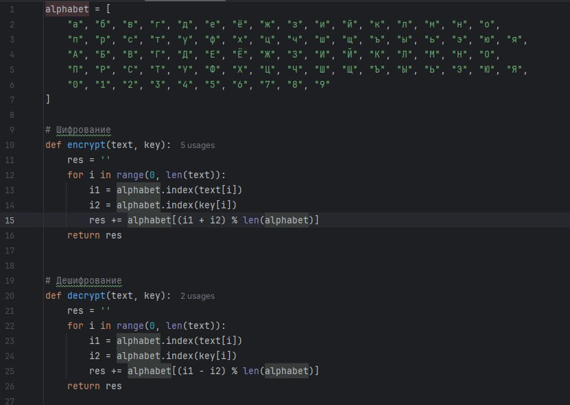
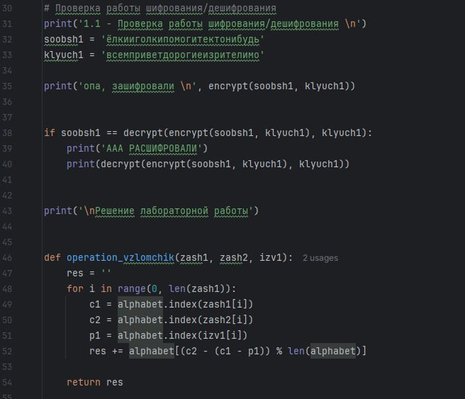
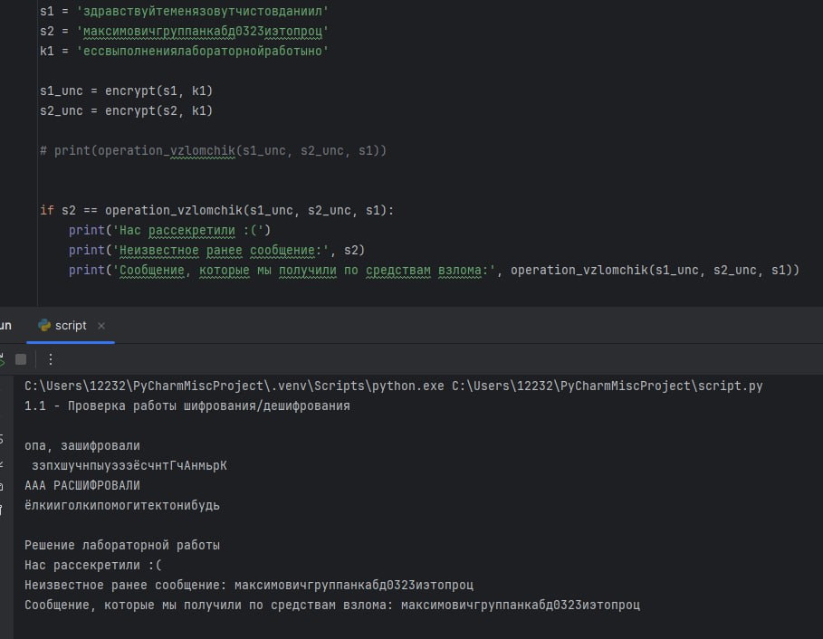

---
## Front matter
title: "Лабораторная работа №8"
subtitle: "Основы Информационной Безопасности"
author: "Чистов Даниил Максимович"

## Generic otions
lang: ru-RU
toc-title: "Содержание"

## Bibliography
bibliography: bib/cite.bib
csl: pandoc/csl/gost-r-7-0-5-2008-numeric.csl

## Pdf output format
toc: true # Table of contents
toc-depth: 2
lof: true # List of figures
lot: false # List of tables
fontsize: 12pt
linestretch: 1.5
papersize: a4
documentclass: scrreprt
## I18n polyglossia
polyglossia-lang:
  name: russian
  options:
	- spelling=modern
	- babelshorthands=true
polyglossia-otherlangs:
  name: english
## I18n babel
babel-lang: russian
babel-otherlangs: english
## Fonts
mainfont: IBM Plex Serif
romanfont: IBM Plex Serif
sansfont: IBM Plex Sans
monofont: IBM Plex Mono
mathfont: STIX Two Math
mainfontoptions: Ligatures=Common,Ligatures=TeX,Scale=0.94
romanfontoptions: Ligatures=Common,Ligatures=TeX,Scale=0.94
sansfontoptions: Ligatures=Common,Ligatures=TeX,Scale=MatchLowercase,Scale=0.94
monofontoptions: Scale=MatchLowercase,Scale=0.94,FakeStretch=0.9
mathfontoptions:
## Biblatex
biblatex: true
biblio-style: "gost-numeric"
biblatexoptions:
  - parentracker=true
  - backend=biber
  - hyperref=auto
  - language=auto
  - autolang=other*
  - citestyle=gost-numeric
## Pandoc-crossref LaTeX customization
figureTitle: "Рис."
tableTitle: "Таблица"
listingTitle: "Листинг"
lofTitle: "Список иллюстраций"
lotTitle: "Список таблиц"
lolTitle: "Листинги"
## Misc options
indent: true
header-includes:
  - \usepackage{indentfirst}
  - \usepackage{float} # keep figures where there are in the text
  - \floatplacement{figure}{H} # keep figures where there are in the text
---

# Цель работы

Освоить на практике применение режима однократного гаммирования на примере кодирования различных исходных текстов одним ключом


# Выполнение лабораторной работы

Требуется написать программу, которая сможет получить расшифрованное сообщение 2, зная только оба зашифрованных сообщения и расшифрованное сообщение 1, без наглядного поиска ключа - на первом фото: функции шифрования и дешифрования текстов. Принцип такой: у нас есть алфавит из русских больших, маленьких букв и цифр. У каждого символа есть индекс. Также индексы есть и у сообщений. Складываем индексы сообщения и ключа, так получаем новый индекс и достаём из алфавита другую букву, соответствующую новому индексу. Дешифрование реализуется также, но вместо сложения, происходит вычитание (рис. [-@fig:001]).

{#fig:001 width=70%}

На втором фото: функция получения расшифрованного сообщения 2, зная сообщение 1 и оба зашифрованных сообщений. Принцип такой, т.к. чтобы получить ключ, нам требовалось вычесть из индекса буквы сообщения индекс буквы ключа, то теперь, чтобы по сути получить ключ мы вычитаем из индекса буквы зашифрованного сообщения индекс буквы расшифрованного сообщения, так мы по сути получили индекс буквы ключа, который можем вычесть из зашифрованного сообщения (рис. [-@fig:001]).

{#fig:002 width=70%}

На третьем фото: результат работы всей программы

{#fig:003 width=70%}

Сам код:

```
alphabet = [
    "а", "б", "в", "г", "д", "е", "ё", "ж", "з", "и", "й", "к", "л", "м", "н", "о",
    "п", "р", "с", "т", "у", "ф", "х", "ц", "ч", "ш", "щ", "ъ", "ы", "ь", "э", "ю", "я",
    "А", "Б", "В", "Г", "Д", "Е", "Ё", "Ж", "З", "И", "Й", "К", "Л", "М", "Н", "О",
    "П", "Р", "С", "Т", "У", "Ф", "Х", "Ц", "Ч", "Ш", "Щ", "Ъ", "Ы", "Ь", "Э", "Ю", "Я",
    "0", "1", "2", "3", "4", "5", "6", "7", "8", "9"
]

# Шифрование
def encrypt(text, key):
    res = ''
    for i in range(0, len(text)):
        i1 = alphabet.index(text[i])
        i2 = alphabet.index(key[i])
        res += alphabet[(i1 + i2) % len(alphabet)]
    return res


# Дешифрование
def decrypt(text, key):
    res = ''
    for i in range(0, len(text)):
        i1 = alphabet.index(text[i])
        i2 = alphabet.index(key[i])
        res += alphabet[(i1 - i2) % len(alphabet)]
    return res


# Проверка работы шифрования/дешифрования
print('1.1 - Проверка работы шифрования/дешифрования \n')
soobsh1 = 'ёлкииголкипомогитектонибудь'
klyuch1 = 'всемприветдорогиеизрителимо'

print('опа, зашифровали \n', encrypt(soobsh1, klyuch1))


if soobsh1 == decrypt(encrypt(soobsh1, klyuch1), klyuch1):
    print('ААА РАСШИФРОВАЛИ')
    print(decrypt(encrypt(soobsh1, klyuch1), klyuch1))


print('\nРешение лабораторной работы')


def operation_vzlomchik(zash1, zash2, izv1):
    res = ''
    for i in range(0, len(zash1)):
        c1 = alphabet.index(zash1[i])
        c2 = alphabet.index(zash2[i])
        p1 = alphabet.index(izv1[i])
        res += alphabet[(c2 - (c1 - p1)) % len(alphabet)]

    return res


s1 = 'здравствуйтеменязовутчистовданиил'
s2 = 'максимовичгруппанкабд0323иэтопроц'
k1 = 'ессвыполнениялабораторнойработыно'

s1_unc = encrypt(s1, k1)
s2_unc = encrypt(s2, k1)

# print(operation_vzlomchik(s1_unc, s2_unc, s1))


if s2 == operation_vzlomchik(s1_unc, s2_unc, s1):
    print('Нас рассекретили :(')
    print('Неизвестное ранее сообщение:', s2)
    print('Сообщение, которые мы получили по средствам взлома:', operation_vzlomchik(s1_unc, s2_unc, s1))
```

# Выводы

В результате выполнения данной лабораторной работы я освоил на практике применение режима однократного гаммирования на примере кодирования различных исходных текстов одним ключом


# Список литературы

[Лабораторная работа №8](https://esystem.rudn.ru/pluginfile.php/2580604/mod_resource/content/2/008-lab_crypto-key.pdf)
