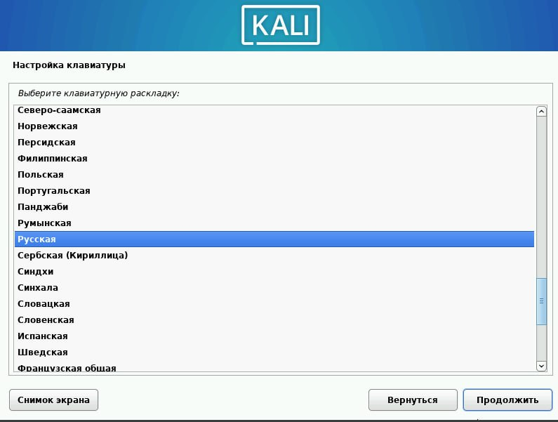
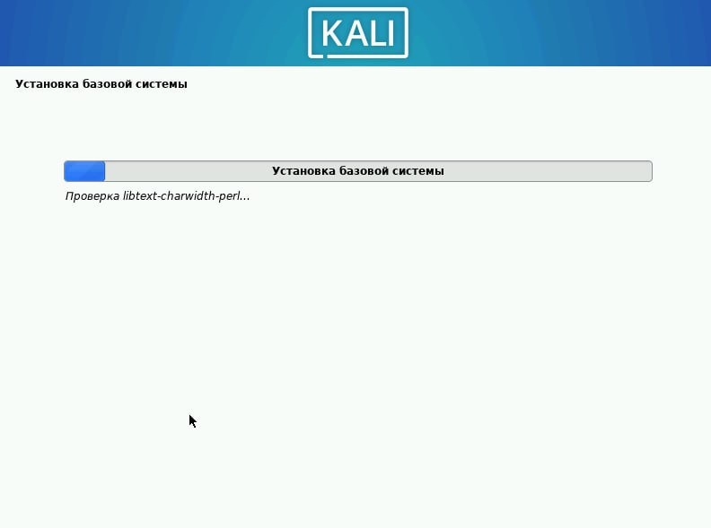

---
## Front matter
lang: ru-RU
title: Индивидуальный проект - Этап 1
subtitle: Основы информационной безопасности
author:
  - Чистов Д. М.
institute:
  - Российский университет дружбы народов, Москва, Россия
  - Объединённый институт ядерных исследований, Дубна, Россия
date: 07 марта 2025

## i18n babel
babel-lang: russian
babel-otherlangs: english

## Formatting pdf
toc: false
toc-title: Содержание
slide_level: 2
aspectratio: 169
section-titles: true
theme: metropolis
header-includes:
 - \metroset{progressbar=frametitle,sectionpage=progressbar,numbering=fraction}
---

# Цель работы

Установка дистрибутива Kali Linux на виртуальную машину

## Задание

1. Установка Kali Linux

# Выполнение лабораторной работы

Перейдём к созданию новой виртуальной машины - Задаю имя и выбираю образ, который я зарнее скачал с официального сайта Kali Linux.

{#fig:001 width=70%}

## Выполнение лабораторной работы

Выделяю 4гб оперативной памяти и 3 ЦП.

{#fig:002 width=70%}

## Выполнение лабораторной работы

Выделяю 40 гб места для моей ОС.

{#fig:003 width=70%}

## Выполнение лабораторной работы

Итоговые характеристики моей виртуальной машины.

{#fig:004 width=70%}

## Выполнение лабораторной работы

Перейдём к установке ОС. Выбираю графический способ установки.

{#fig:005 width=70%}

## Выполнение лабораторной работы

Выбираю язык установщика, который также будет использоваться в моей ОС, как основной.

{#fig:006 width=70%}

## Выполнение лабораторной работы

Выбираю язык для клавиатуры.

{#fig:007 width=70%}

## Выполнение лабораторной работы

Задаю имя "компьютера" согласно регламенту.

{#fig:008 width=70%}

## Выполнение лабораторной работы

Задаю имя домена.

{#fig:009 width=70%}

## Выполнение лабораторной работы

Задаю имя пользователя согласно регламенту.

{#fig:010 width=70%}

## Выполнение лабораторной работы

Задаю имя учётной записи.

{#fig:011 width=70%}

## Выполнение лабораторной работы

Задаю пароль для учётной записи.

{#fig:012 width=70%}

## Выполнение лабораторной работы

Задаю часовой - Москва.

{#fig:013 width=70%}

## Выполнение лабораторной работы

Выбираю метод разметки диска.

{#fig:014 width=70%}

## Выполнение лабораторной работы

Выбираю жёсткий диск.

{#fig:015 width=70%}

## Выполнение лабораторной работы

Подтверждаю схему разметки.

{#fig:016 width=70%}

## Выполнение лабораторной работы

Завершение процесса разметки дисков.

{#fig:017 width=70%}

## Выполнение лабораторной работы

Началась устанвока базовой системы Kali Linux.

{#fig:018 width=70%}

## Выполнение лабораторной работы

Выбор программного обеспечения - я решил выбрать xfce, т.к. узнал, что это способствует быстродействую ОС, по сравнению с аналогами.

{#fig:019 width=70%}

## Выполнение лабораторной работы

Установка системного загрузчика.

{#fig:020 width=70%}

## Выполнение лабораторной работы

Система успешно установлена.

{#fig:021 width=70%}

# Выводы

При выполнении данной лабораторной работы - я вспомнил, как устанавливать операционный системы, приступил к знакомству с Kali Linux.

# Список литературы

[Индивидуальный проект](https://esystem.rudn.ru/mod/page/view.php?id=1220137#citeproc_bib_item_1)

[Сайт Kali Linux](https://www.kali.org/)
