---
## Front matter
title: "Индивидуальный проект - Этап 1"
subtitle: "Основы информационной безопасности"
author: "Чистов Даниил Максимович"

## Generic otions
lang: ru-RU
toc-title: "Содержание"

## Bibliography
bibliography: bib/cite.bib
csl: pandoc/csl/gost-r-7-0-5-2008-numeric.csl

## Pdf output format
toc: true # Table of contents
toc-depth: 2
lof: true # List of figures
lot: false # List of tables
fontsize: 12pt
linestretch: 1.5
papersize: a4
documentclass: scrreprt
## I18n polyglossia
polyglossia-lang:
  name: russian
  options:
	- spelling=modern
	- babelshorthands=true
polyglossia-otherlangs:
  name: english
## I18n babel
babel-lang: russian
babel-otherlangs: english
## Fonts
mainfont: IBM Plex Serif
romanfont: IBM Plex Serif
sansfont: IBM Plex Sans
monofont: IBM Plex Mono
mathfont: STIX Two Math
mainfontoptions: Ligatures=Common,Ligatures=TeX,Scale=0.94
romanfontoptions: Ligatures=Common,Ligatures=TeX,Scale=0.94
sansfontoptions: Ligatures=Common,Ligatures=TeX,Scale=MatchLowercase,Scale=0.94
monofontoptions: Scale=MatchLowercase,Scale=0.94,FakeStretch=0.9
mathfontoptions:
## Biblatex
biblatex: true
biblio-style: "gost-numeric"
biblatexoptions:
  - parentracker=true
  - backend=biber
  - hyperref=auto
  - language=auto
  - autolang=other*
  - citestyle=gost-numeric
## Pandoc-crossref LaTeX customization
figureTitle: "Рис."
tableTitle: "Таблица"
listingTitle: "Листинг"
lofTitle: "Список иллюстраций"
lotTitle: "Список таблиц"
lolTitle: "Листинги"
## Misc options
indent: true
header-includes:
  - \usepackage{indentfirst}
  - \usepackage{float} # keep figures where there are in the text
  - \floatplacement{figure}{H} # keep figures where there are in the text
---

# Цель работы

Установка дистрибутива Kali Linux на виртуальную машину

# Задание

1. Установка Kali Linux

# Выполнение лабораторной работы

Перейдём к созданию новой виртуальной машины - Задаю имя и выбираю образ, который я зарнее скачал с официального сайта Kali Linux (рис. [-@fig:001]).

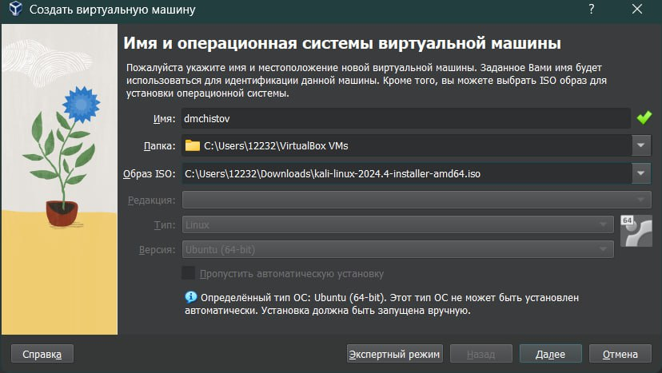{#fig:001 width=70%}

Выделяю 4гб оперативной памяти и 3 ЦП. (рис. [-@fig:002]).

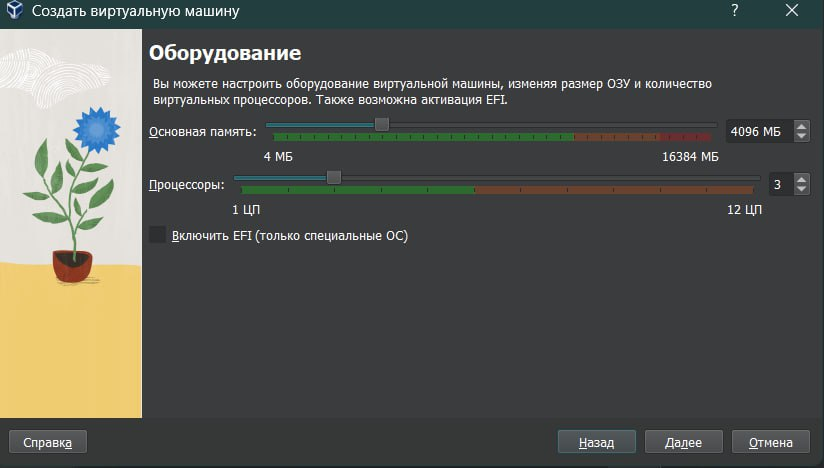{#fig:002 width=70%}

Выделяю 40 гб места для моей ОС (рис. [-@fig:003]).

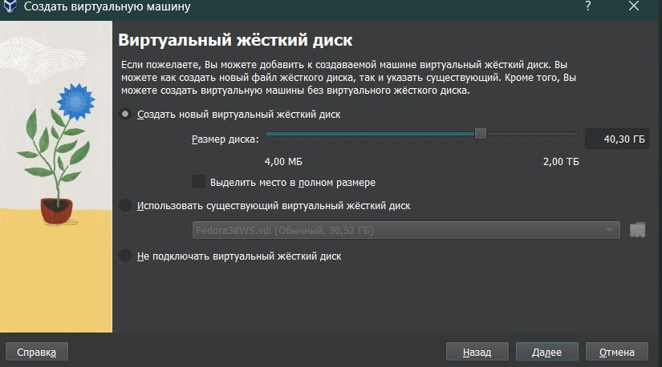{#fig:003 width=70%}

Итоговые характеристики моей виртуальной машины (рис. [-@fig:004]).

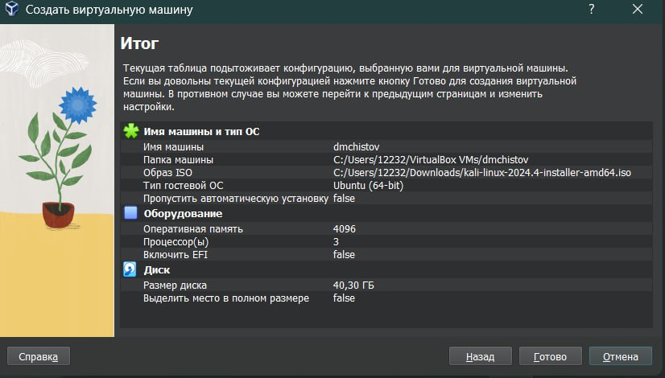{#fig:004 width=70%}

Перейдём к установке ОС. Выбираю графический способ установки (рис. [-@fig:005]).

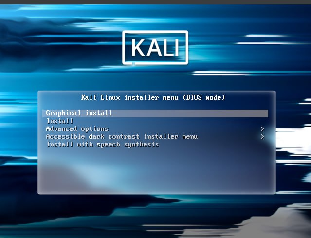{#fig:005 width=70%}

Выбираю язык установщика, который также будет использоваться в моей ОС, как основной (рис. [-@fig:006]).

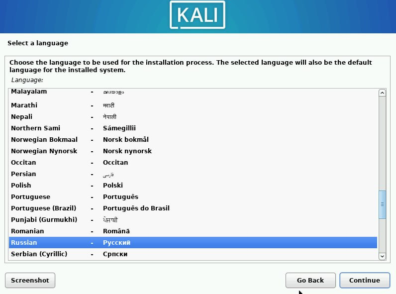{#fig:006 width=70%}

Выбираю язык для клавиатуры (рис. [-@fig:007]).

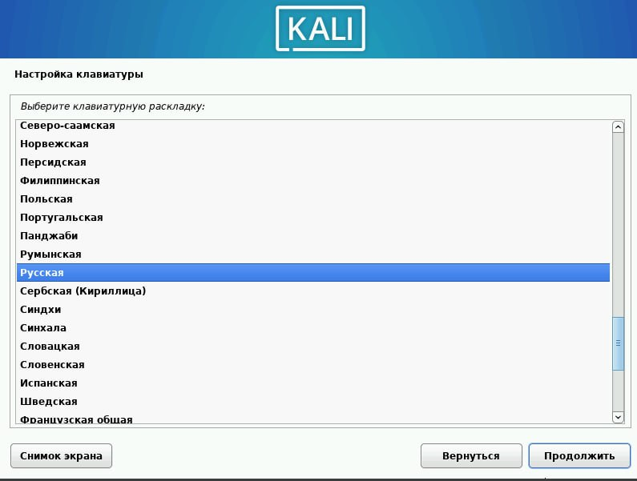{#fig:007 width=70%}

Задаю имя "компьютера" согласно регламенту (рис. [-@fig:008]).

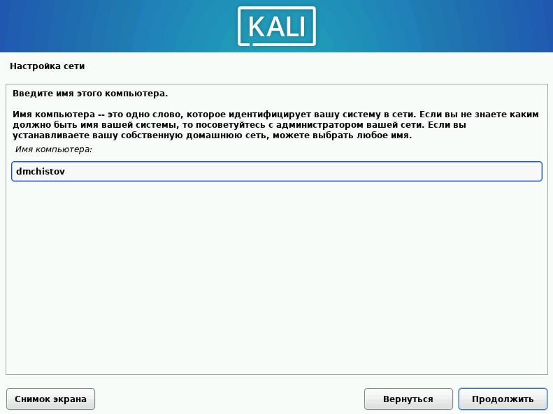{#fig:008 width=70%}

Задаю имя домена (рис. [-@fig:009]).

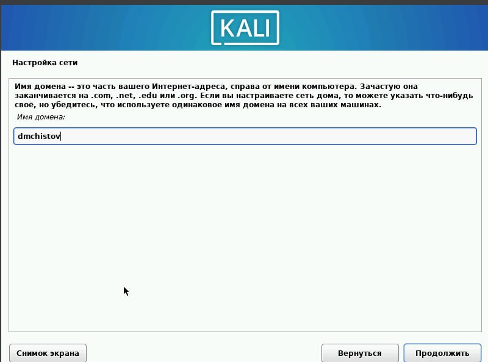{#fig:009 width=70%}

Задаю имя пользователя согласно регламенту (рис. [-@fig:010]).

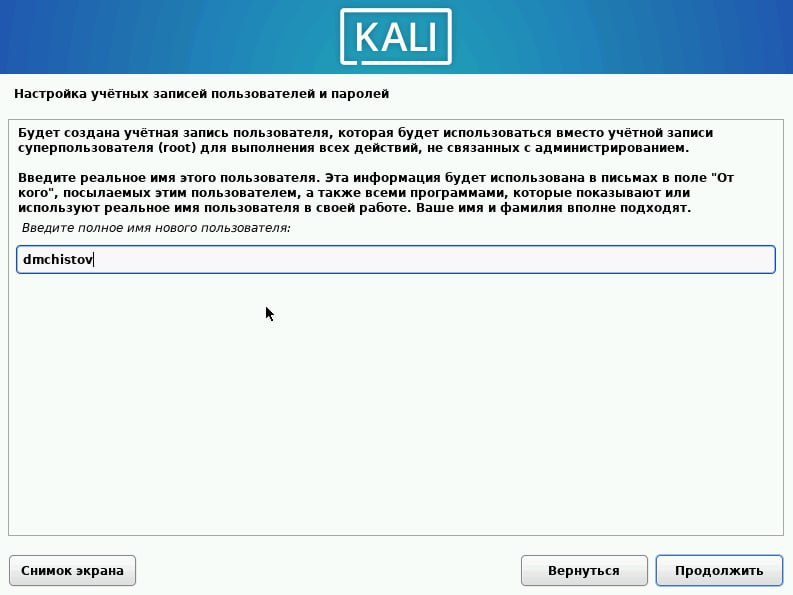{#fig:010 width=70%}

Задаю имя учётной записи (рис. [-@fig:011]).

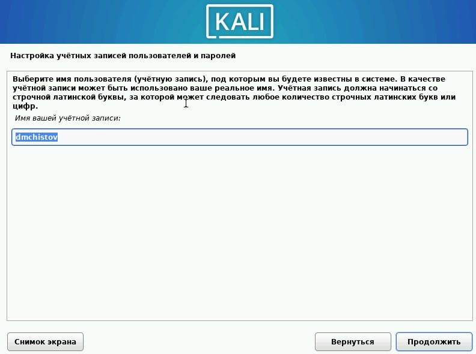{#fig:011 width=70%}

Задаю пароль для учётной записи (рис. [-@fig:012]).

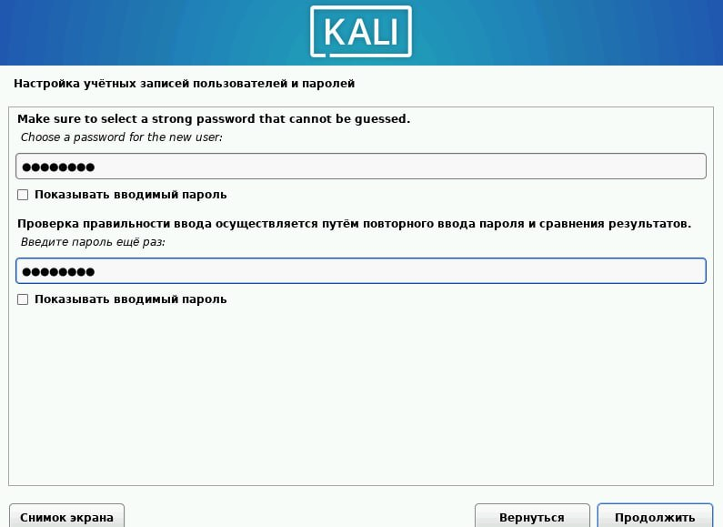{#fig:012 width=70%}

Задаю часовой - Москва (рис. [-@fig:013]).

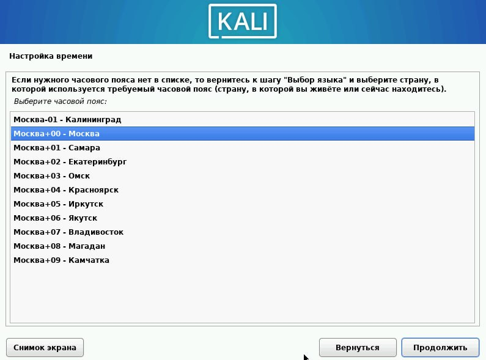{#fig:013 width=70%}

Выбираю метод разметки диска (рис. [-@fig:014]).

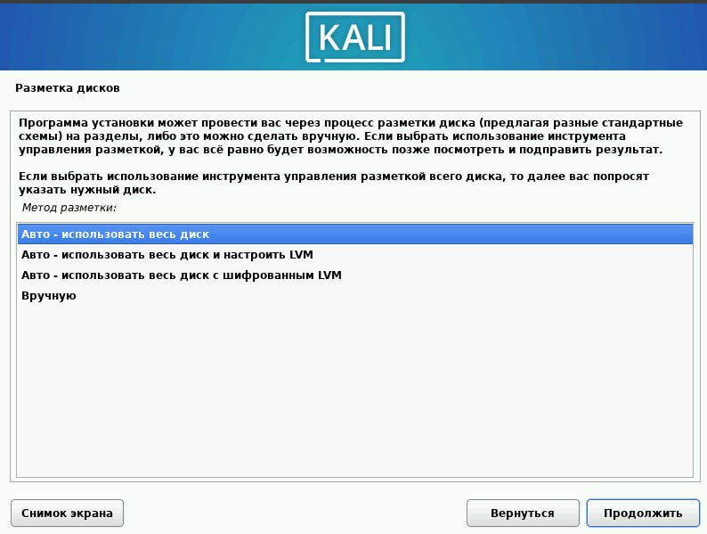{#fig:014 width=70%}

Выбираю жёсткий диск (рис. [-@fig:015]).

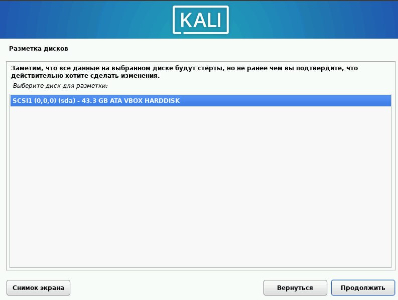{#fig:015 width=70%}

Подтверждаю схему разметки (рис. [-@fig:016]).

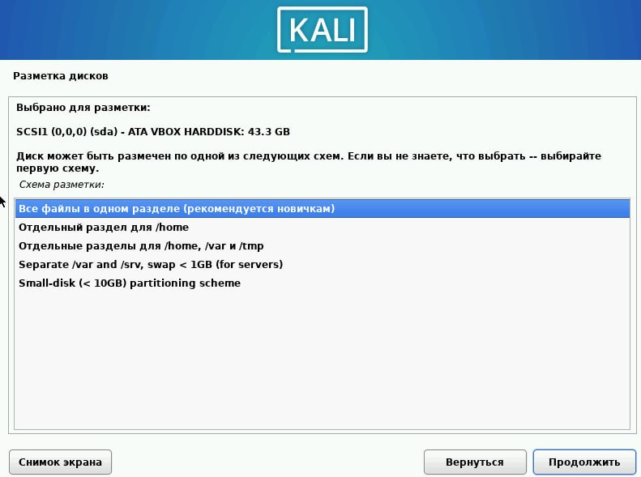{#fig:016 width=70%}

Завершение процесса разметки дисков (рис. [-@fig:017]).

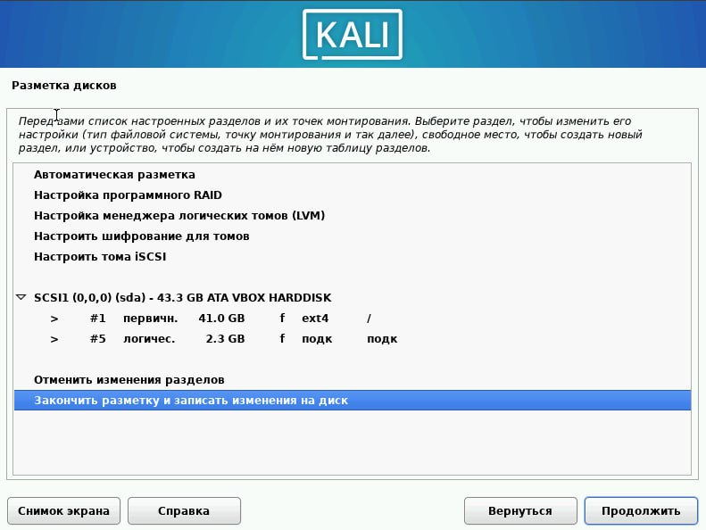{#fig:017 width=70%}

Началась устанвока базовой системы Kali Linux (рис. [-@fig:018]).

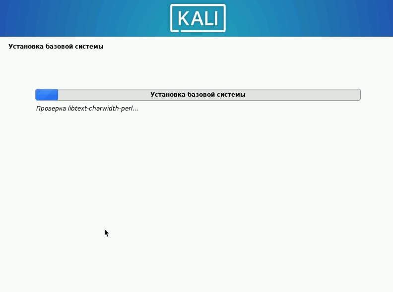{#fig:018 width=70%}

Выбор программного обеспечения - я решил выбрать xfce, т.к. узнал, что это способствует быстродействую ОС, по сравнению с аналогами (рис. [-@fig:019]).

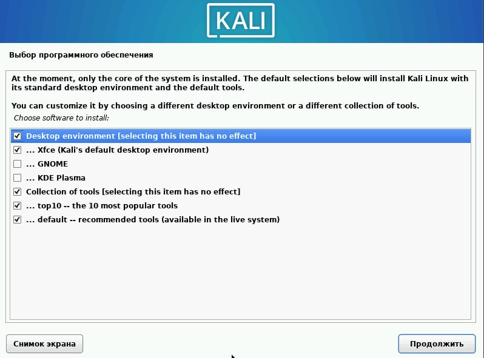{#fig:019 width=70%}

Установка системного загрузчика (рис. [-@fig:020]).

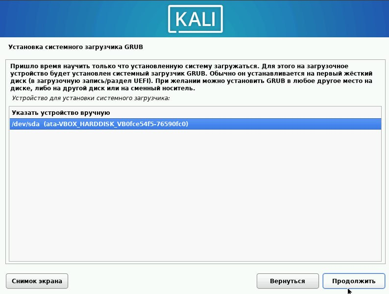{#fig:020 width=70%}

Система успешно установлена (рис. [-@fig:021]).

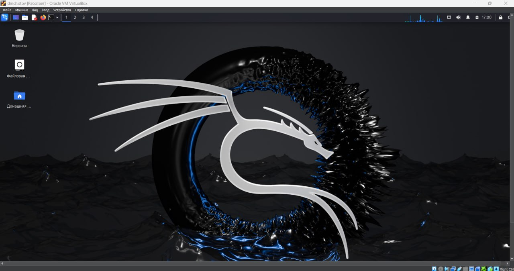{#fig:021 width=70%}

# Выводы

При выполнении данной лабораторной работы - я вспомнил, как устанавливать операционный системы, приступил к знакомству с Kali Linux.

# Список литературы

[Индивидуальный проект](https://esystem.rudn.ru/mod/page/view.php?id=1220137#citeproc_bib_item_1)

[Сайт Kali Linux](https://www.kali.org/)
