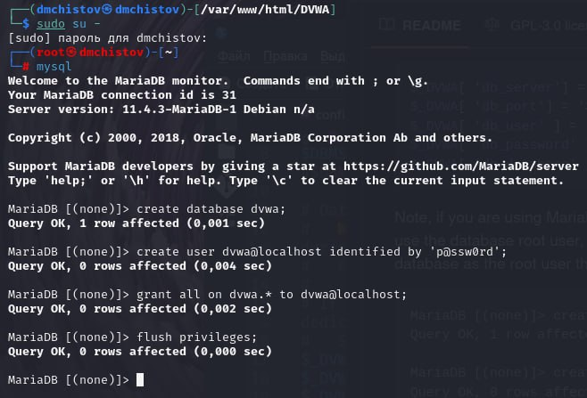

---
## Front matter
lang: ru-RU
title: Индивидуальный проект - Этап 2
subtitle: Основы информационной безопасности
author:
  - Чистов Д. М.
institute:
  - Российский университет дружбы народов, Москва, Россия
  - Объединённый институт ядерных исследований, Дубна, Россия
date: 22 марта 2025

## i18n babel
babel-lang: russian
babel-otherlangs: english

## Formatting pdf
toc: false
toc-title: Содержание
slide_level: 2
aspectratio: 169
section-titles: true
theme: metropolis
header-includes:
 - \metroset{progressbar=frametitle,sectionpage=progressbar,numbering=fraction}
---

# Цель работы

Установка дистрибутива DVWA на Kali Linux

# Выполнение лабораторной работы

Данную работу я выполнял, следуя видео руководству, прикреплённому к официальному репозиторию.

Клонирую DVWA из официального репозитория.

{#fig:001 width=70%}

## Выполнение лабораторной работы

Далее специально перевожу установленную папку в раздел /var/www/html, чтобы можно было пользоваться DVWA через localhost.

{#fig:002 width=70%}

## Выполнение лабораторной работы

Чтобы пользоваться DVWA нам также требуется запустить apache2.

{#fig:003 width=70%}

## Выполнение лабораторной работы

Однако пока DVWA не работает - нам пишут, что требуется скопировать файл конфигурации таким образом, чтобы у него исчезло расширение .dist.

{#fig:004 width=70%}

## Выполнение лабораторной работы

Т.к. я пользуюсь Kali Linux, у меня установлен MariaDB и в связи с этим от меня требуется самостоятельно создать "database user".

{#fig:005 width=70%}

## Выполнение лабораторной работы

Удостоверяюсь, что пользователь успешно создан. Всё работает.

{#fig:006 width=70%}

## Выполнение лабораторной работы

Теперь возвращаюсь в DVWA и нажимаю "Create/Reset Database".

{#fig:007 width=70%}

## Выполнение лабораторной работы

База данных успешно создана.

{#fig:008 width=70%}

## Выполнение лабораторной работы

Теперь меня автоматически переводит на страницу входа, ввожу данные по умолчанию - admin и его пароль.

{#fig:009 width=70%}

## Выполнение лабораторной работы

DVWA успешно установлена и конфигурация завершена.

{#fig:010 width=70%}

# Выводы

При выполнении данной работы я успешно установил Damn Vulnurable Web Application.

# Список литературы

[Индивидуальный проект](https://esystem.rudn.ru/mod/page/view.php?id=1220137#citeproc_bib_item_1)

[DVWA](https://github.com/digininja/DVWA)

[Видео руководство по установке DVWA на Kali Linux](https://www.youtube.com/watch?v=WkyDxNJkgQ4)
