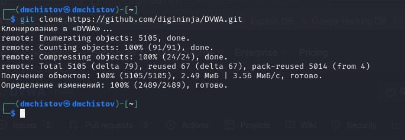
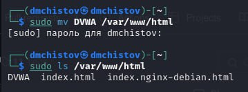
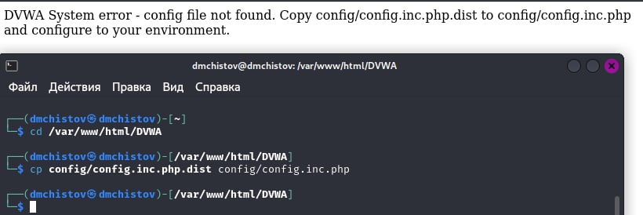
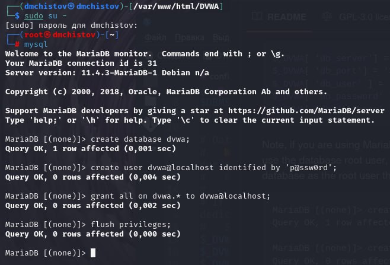
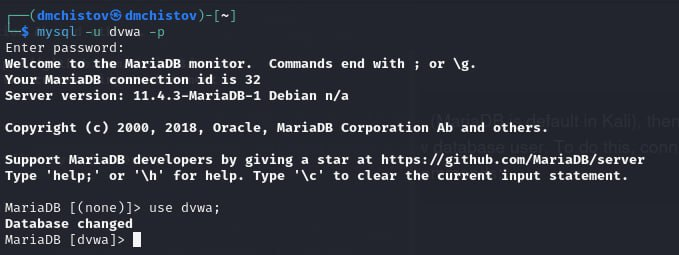
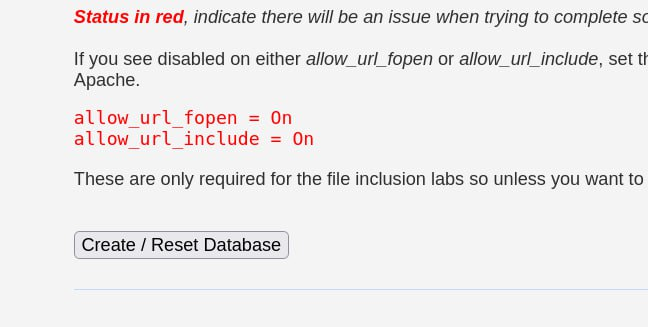
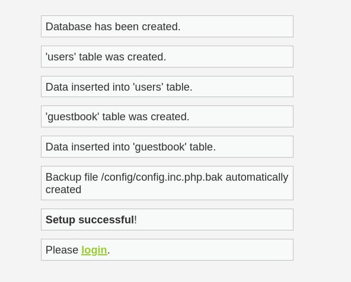
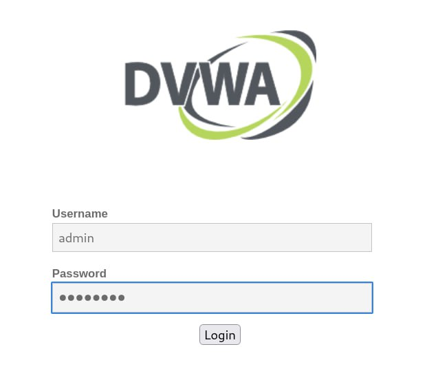
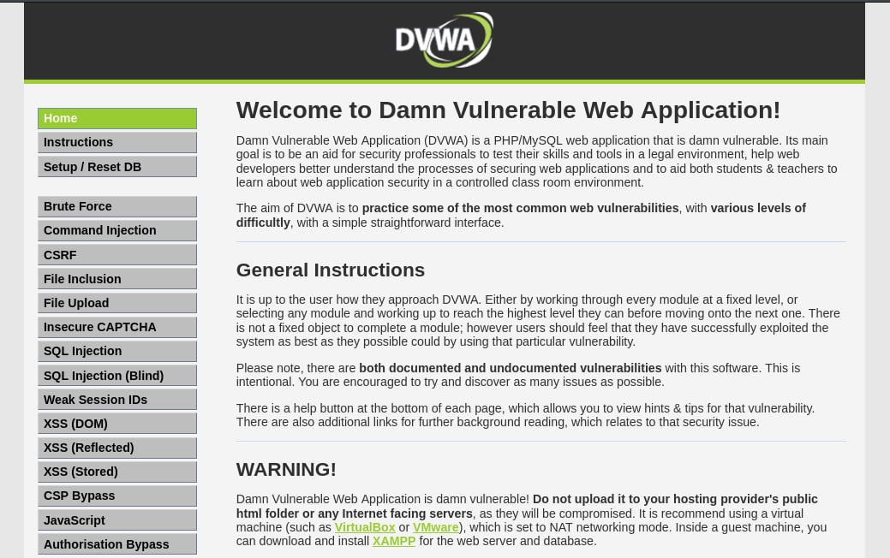

---
## Front matter
title: "Индивидуальный проект - Этап 2"
subtitle: "Основы информационной безопасности"
author: "Чистов Даниил Максимович"

## Generic otions
lang: ru-RU
toc-title: "Содержание"

## Bibliography
bibliography: bib/cite.bib
csl: pandoc/csl/gost-r-7-0-5-2008-numeric.csl

## Pdf output format
toc: true # Table of contents
toc-depth: 2
lof: true # List of figures
lot: false # List of tables
fontsize: 12pt
linestretch: 1.5
papersize: a4
documentclass: scrreprt
## I18n polyglossia
polyglossia-lang:
  name: russian
  options:
	- spelling=modern
	- babelshorthands=true
polyglossia-otherlangs:
  name: english
## I18n babel
babel-lang: russian
babel-otherlangs: english
## Fonts
mainfont: IBM Plex Serif
romanfont: IBM Plex Serif
sansfont: IBM Plex Sans
monofont: IBM Plex Mono
mathfont: STIX Two Math
mainfontoptions: Ligatures=Common,Ligatures=TeX,Scale=0.94
romanfontoptions: Ligatures=Common,Ligatures=TeX,Scale=0.94
sansfontoptions: Ligatures=Common,Ligatures=TeX,Scale=MatchLowercase,Scale=0.94
monofontoptions: Scale=MatchLowercase,Scale=0.94,FakeStretch=0.9
mathfontoptions:
## Biblatex
biblatex: true
biblio-style: "gost-numeric"
biblatexoptions:
  - parentracker=true
  - backend=biber
  - hyperref=auto
  - language=auto
  - autolang=other*
  - citestyle=gost-numeric
## Pandoc-crossref LaTeX customization
figureTitle: "Рис."
tableTitle: "Таблица"
listingTitle: "Листинг"
lofTitle: "Список иллюстраций"
lotTitle: "Список таблиц"
lolTitle: "Листинги"
## Misc options
indent: true
header-includes:
  - \usepackage{indentfirst}
  - \usepackage{float} # keep figures where there are in the text
  - \floatplacement{figure}{H} # keep figures where there are in the text
---

# Цель работы

Установка дистрибутива DVWA на Kali Linux

# Выполнение лабораторной работы

Данную работу я выполнял, следуя видео руководству, прикреплённому к официальному репозиторию.

Клонирую DVWA из официального репозитория (рис. [-@fig:001]).

{#fig:001 width=70%}

Далее специально перевожу установленную папку в раздел /var/www/html, чтобы можно было пользоваться DVWA через localhost (рис. [-@fig:002]).

{#fig:002 width=70%}

Чтобы пользоваться DVWA нам также требуется запустить apache2 (рис. [-@fig:003]).

{#fig:003 width=70%}

Однако пока DVWA не работает - нам пишут, что требуется скопировать файл конфигурации таким образом, чтобы у него исчезло расширение .dist. Таким образом у нас всегда будет резервная копия конфига, а также так нас призывают к самостоятельной настройке этого самого конфига (рис. [-@fig:004]).

{#fig:004 width=70%}

Т.к. я пользуюсь Kali Linux, у меня установлен MariaDB и в связи с этим от меня требуется самостоятельно создать "database user". Поэтому становлюсь рут пользователем, запускаю mysql и прописываю пару команд, которые есть в официальном репозитории, таким образом я создал пользователя баз данных и теперь успешно могу создавать свои базы данных для работы с DVWA (рис. [-@fig:005]).

{#fig:005 width=70%}

Удостоверяюсь, что пользователь успешно создан. Всё работает (рис. [-@fig:006]).

{#fig:006 width=70%}

Теперь возвращаюсь в DVWA и нажимаю "Create/Reset Database" (рис. [-@fig:007]).

{#fig:007 width=70%}

База данных успешно создана (рис. [-@fig:008]).

{#fig:008 width=70%}

Теперь меня автоматически переводит на страницу входа, ввожу данные по умолчанию - admin и его пароль (рис. [-@fig:009]).

{#fig:009 width=70%}

DVWA успешно установлена и конфигурация завершена (рис. [-@fig:010]).

{#fig:010 width=70%}

# Выводы

При выполнении данной работы я успешно установил Damn Vulnurable Web Application.

# Список литературы

[Индивидуальный проект](https://esystem.rudn.ru/mod/page/view.php?id=1220137#citeproc_bib_item_1)

[DVWA](https://github.com/digininja/DVWA)

[Видео руководство по установке DVWA на Kali Linux](https://www.youtube.com/watch?v=WkyDxNJkgQ4)
