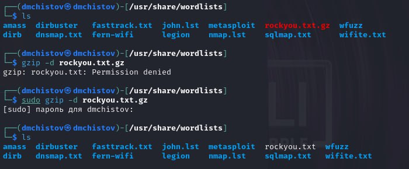
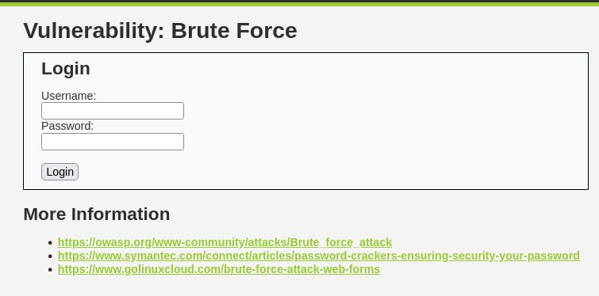
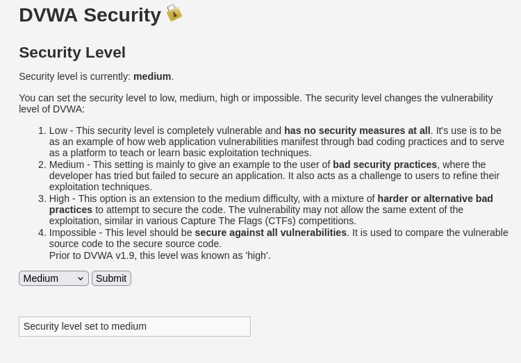
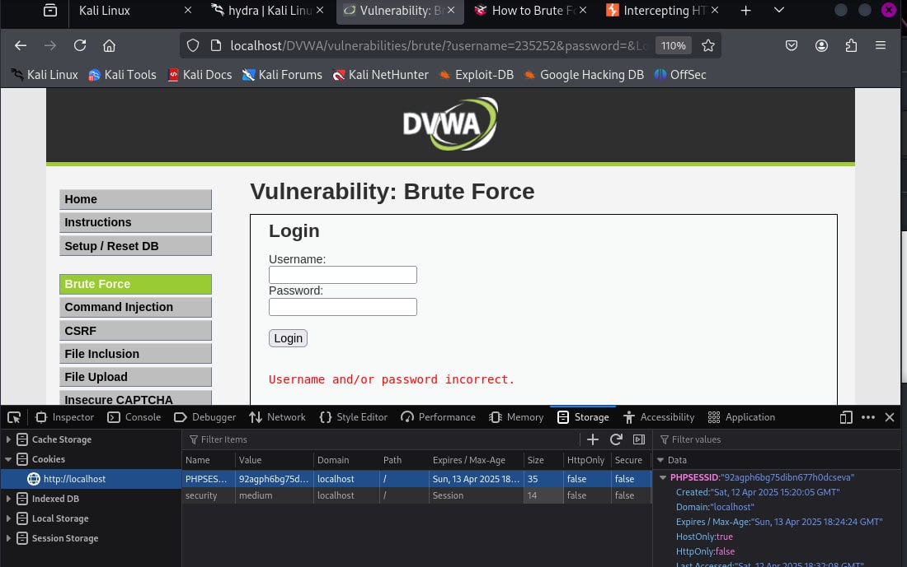
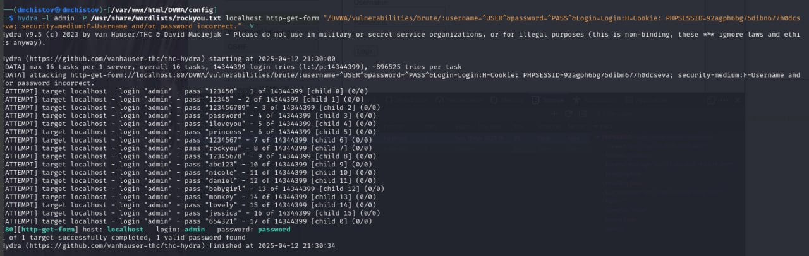
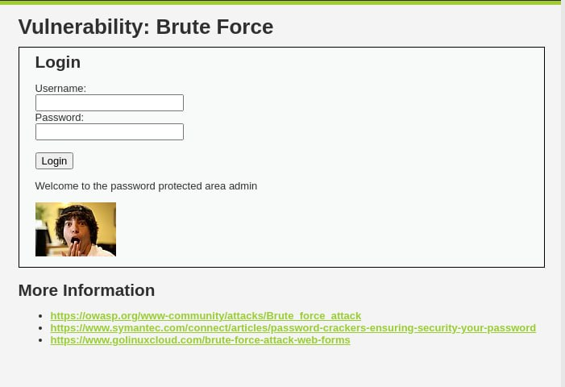

---
## Front matter
lang: ru-RU
title: Индивидуальный проект - Этап 3
subtitle: Основы информационной безопасности
author:
  - Чистов Д. М.
institute:
  - Российский университет дружбы народов, Москва, Россия
  - Объединённый институт ядерных исследований, Дубна, Россия
date: 12 апреля 2025

## i18n babel
babel-lang: russian
babel-otherlangs: english

## Formatting pdf
toc: false
toc-title: Содержание
slide_level: 2
aspectratio: 169
section-titles: true
theme: metropolis
header-includes:
 - \metroset{progressbar=frametitle,sectionpage=progressbar,numbering=fraction}
---

# Цель работы

Получение навыков пользование утилитой Hydra

# Выполнение лабораторной работы

Мне потребуется список часто используемых паролей, в Kali Linux уже есть такой список в виде файла, его лишь нужно разархивировать.

{#fig:001 width=70%}

## Выполнение лабораторной работы

Захожу на страничку DVWA про Brute Force.

{#fig:002 width=70%}

## Выполнение лабораторной работы

Важно отметить, что в DVWA есть несколько уровней защиты, которые можно самостоятельно менять. По автомату стоит Impossible, в таком режиме Brute Force бесполезен. Поэтому нужно поменять уровень защиты на medium.

{#fig:003 width=70%}

## Выполнение лабораторной работы

Захожу на страничку про Brute Force, пытаюсь войти с случайным паролем. Не выходит, для работы с Hydra нам потребуется Cookie нашего веб приложения. Нужные нам куки можно найти, открыв инструменты разработчика в браузере.

{#fig:004 width=70%}

## Выполнение лабораторной работы

После этого пишу следующую команду:

```hydra -l admin -P /usr/share/wordlists/rockyou.txt localhost http-get-form "/DVWA/vulnerabilities/brute/:username=^USER^&password=^PASS^&Login=Login:H=Cookie: PHPSESSID=92agph6bg75dibn677h0dcseva; security=medium:F=Username and/or password incorrect." -V```

* -l admin - логин всегда будет admin

* -p /путь/ - указываем пароли и подаём путь к файлу со списком

* http-get-form - используем http GET-request, также существует POST-Request, и Hydra его поддерживает, но на уровне защиты medium такой реквест не сработает.

## Выполнение лабораторной работы

Теперь сам реквест: "/DVWA/vulnerabilities/brute/:username=^USER^&password=^PASS^&Login=Login:H=Cookie: PHPSESSID=92agph6bg75dibn677h0dcseva; security=medium:F=Username and/or password incorrect." -V"

* Мы указываем путь к нашей веб-страничке: /DVWA/vulnerabilities/brute/

* Указываем, что username и пароль те, что мы подали в начале команды,

* Подаём H= наши куки,

* а F= - текст, который выводится при неправильном логине - так Hydra будет понимать, что попытка подобрать пароль не было успешной, если в веб-страничке встречается такой текст.

* -V пишу, чтобы команда выводила более детальную информацию

## Выполнение лабораторной работы

{#fig:005 width=70%}

## Выполнение лабораторной работы

После того, как Hydra закончила работу. Она нам сообщила, что подоходящий пароль - password. Воспользуемся им при входе. Всё успешно! Мы взломали аккаунт Brute Force'ом и теперь имеем доступ.

{#fig:006 width=70%}


# Выводы

При выполнении данной работы я успешно получил навыки работы с Hydra, а также изучил метод уязвимости - Brute Force

# Список литературы

[Индивидуальный проект](https://esystem.rudn.ru/mod/page/view.php?id=1220137#citeproc_bib_item_1)

[о Hydra в Kali Linux](https://www.kali.org/tools/hydra/)

[Список паролей в Kali Linux](https://www.kali.org/tools/wordlists/)
