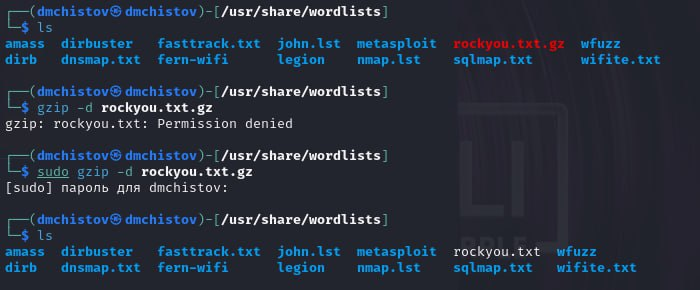
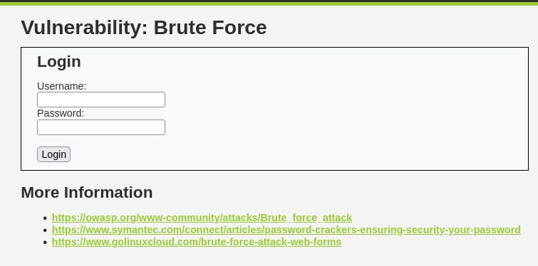
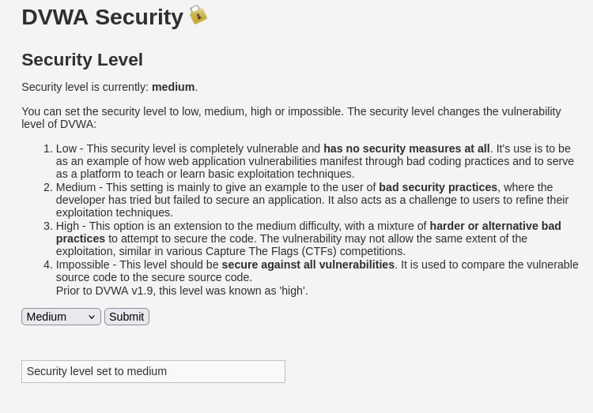
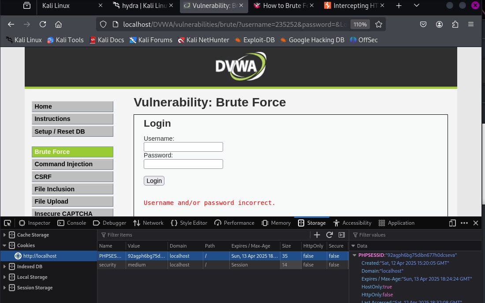
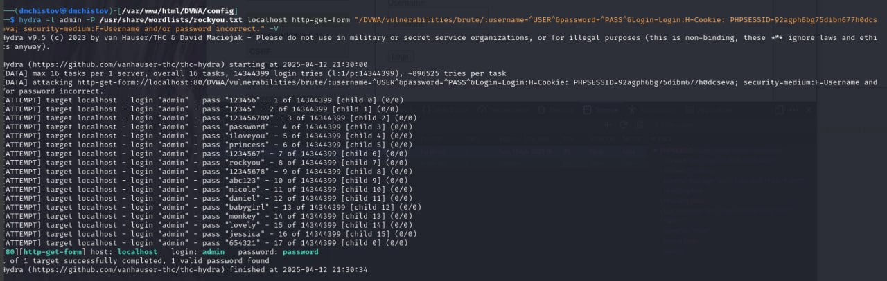
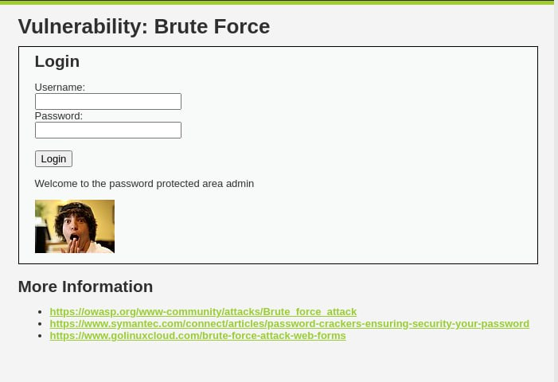

---
## Front matter
title: "Индивидуальный проект - Этап 3"
subtitle: "Основы информационной безопасности"
author: "Чистов Даниил Максимович"

## Generic otions
lang: ru-RU
toc-title: "Содержание"

## Bibliography
bibliography: bib/cite.bib
csl: pandoc/csl/gost-r-7-0-5-2008-numeric.csl

## Pdf output format
toc: true # Table of contents
toc-depth: 2
lof: true # List of figures
lot: false # List of tables
fontsize: 12pt
linestretch: 1.5
papersize: a4
documentclass: scrreprt
## I18n polyglossia
polyglossia-lang:
  name: russian
  options:
	- spelling=modern
	- babelshorthands=true
polyglossia-otherlangs:
  name: english
## I18n babel
babel-lang: russian
babel-otherlangs: english
## Fonts
mainfont: IBM Plex Serif
romanfont: IBM Plex Serif
sansfont: IBM Plex Sans
monofont: IBM Plex Mono
mathfont: STIX Two Math
mainfontoptions: Ligatures=Common,Ligatures=TeX,Scale=0.94
romanfontoptions: Ligatures=Common,Ligatures=TeX,Scale=0.94
sansfontoptions: Ligatures=Common,Ligatures=TeX,Scale=MatchLowercase,Scale=0.94
monofontoptions: Scale=MatchLowercase,Scale=0.94,FakeStretch=0.9
mathfontoptions:
## Biblatex
biblatex: true
biblio-style: "gost-numeric"
biblatexoptions:
  - parentracker=true
  - backend=biber
  - hyperref=auto
  - language=auto
  - autolang=other*
  - citestyle=gost-numeric
## Pandoc-crossref LaTeX customization
figureTitle: "Рис."
tableTitle: "Таблица"
listingTitle: "Листинг"
lofTitle: "Список иллюстраций"
lotTitle: "Список таблиц"
lolTitle: "Листинги"
## Misc options
indent: true
header-includes:
  - \usepackage{indentfirst}
  - \usepackage{float} # keep figures where there are in the text
  - \floatplacement{figure}{H} # keep figures where there are in the text
---

# Цель работы

Получение навыков пользование утилитой Hydra

# Выполнение лабораторной работы

Мне потребуется список часто используемых паролей, в Kali Linux уже есть такой список в виде файла, его лишь нужно разархивировать (рис. [-@fig:001]).

{#fig:001 width=70%}

Захожу на страничку DVWA про Brute Force (рис. [-@fig:002]).

{#fig:002 width=70%}

Важно отметить, что в DVWA есть несколько уровней защиты, которые можно самостоятельно менять. По автомату стоит Impossible, в таком режиме Brute Force бесполезен. Поэтому нужно поменять уровень защиты на medium (рис. [-@fig:003]).

{#fig:003 width=70%}

Захожу на страничку про Brute Force, пытаюсь войти с случайным паролем. Не выходит, для работы с Hydra нам потребуется Cookie нашего веб приложения. Нужные нам куки можно найти, открыв инструменты разработчика в браузере (рис. [-@fig:004]).

{#fig:004 width=70%}

После этого пишу следующую команду (рис. [-@fig:005]):

```hydra -l admin -P /usr/share/wordlists/rockyou.txt localhost http-get-form "/DVWA/vulnerabilities/brute/:username=^USER^&password=^PASS^&Login=Login:H=Cookie: PHPSESSID=92agph6bg75dibn677h0dcseva; security=medium:F=Username and/or password incorrect." -V```

* -l admin - логин всегда будет admin

* -p /путь/ - указываем пароли и подаём путь к файлу со списком

* http-get-form - используем http GET-request, также существует POST-Request, и Hydra его поддерживает, но на уровне защиты medium такой реквест не сработает.

Теперь сам реквест: "/DVWA/vulnerabilities/brute/:username=^USER^&password=^PASS^&Login=Login:H=Cookie: PHPSESSID=92agph6bg75dibn677h0dcseva; security=medium:F=Username and/or password incorrect." -V"

* Мы указываем путь к нашей веб-страничке: /DVWA/vulnerabilities/brute/

* Указываем, что username и пароль те, что мы подали в начале команды,

* Подаём H= наши куки,

* а F= - текст, который выводится при неправильном логине - так Hydra будет понимать, что попытка подобрать пароль не было успешной, если в веб-страничке встречается такой текст.

* -V пишу, чтобы команда выводила более детальную информацию

{#fig:005 width=70%}

После того, как Hydra закончила работу. Она нам сообщила, что подоходящий пароль - password. Воспользуемся им при входе. Всё успешно! Мы взломали аккаунт Brute Force'ом и теперь имеем доступ (рис. [-@fig:006]).

{#fig:006 width=70%}


# Выводы

При выполнении данной работы я успешно получил навыки работы с Hydra, а также изучил метод уязвимости - Brute Force

# Список литературы

[Индивидуальный проект](https://esystem.rudn.ru/mod/page/view.php?id=1220137#citeproc_bib_item_1)

[о Hydra в Kali Linux](https://www.kali.org/tools/hydra/)

[Список паролей в Kali Linux](https://www.kali.org/tools/wordlists/)
