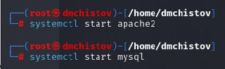
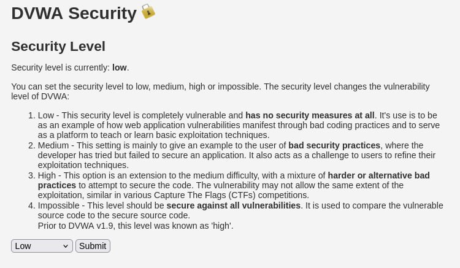
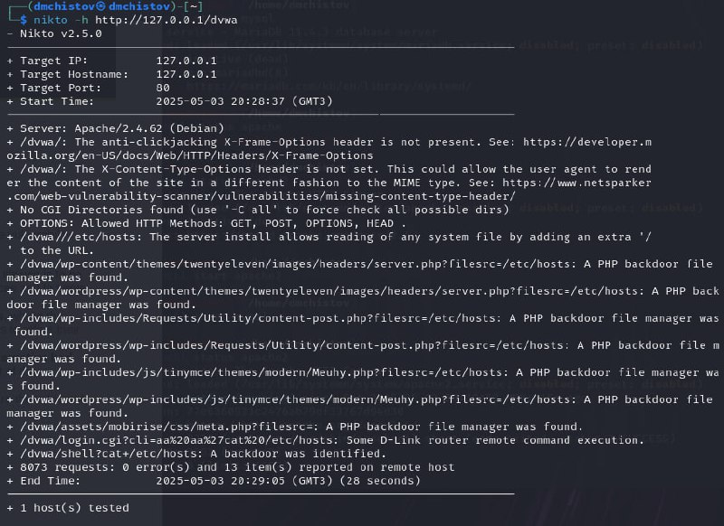

---
## Front matter
lang: ru-RU
title: Индивидуальный проект - Этап 4
subtitle: Основы информационной безопасности
author:
  - Чистов Д. М.
institute:
  - Российский университет дружбы народов, Москва, Россия
  - Объединённый институт ядерных исследований, Дубна, Россия
date: 03 мая 2025

## i18n babel
babel-lang: russian
babel-otherlangs: english

## Formatting pdf
toc: false
toc-title: Содержание
slide_level: 2
aspectratio: 169
section-titles: true
theme: metropolis
header-includes:
 - \metroset{progressbar=frametitle,sectionpage=progressbar,numbering=fraction}
---

# Цель работы

Получение навыков пользование nikto.

## Введение

nikto - это базовый сканнер веб-приложений на уязвимости серверного уровня, т.е. ищет уязвимые файлы, скрипты, делает HTTP-запросы.

# Выполнение лабораторной работы

Перед работой надо запустить apache2 и mysql, буду тестировать nikto на dvwa.

{#fig:001 width=70%}

## Выполнение лабораторной работы

В начале работы я думал протестировать dvwa на разных уровнях защиты, однако оказалось это бесполезно, ведь никто проверяет веб-приложения на уязвимости другого типа, а DVWA выставляет уровни защиты, которые проявляются в логике работы самого веб-приложения, а не его серверную структуру.

{#fig:002 width=70%}

## Выполнение лабораторной работы

Пишем команду

```
nikto -h http://127.0.0.1/dvwa
```

Здесь -h - задаём хоста (кого будем анализировать), и дальше идёт URL нашего хоста. Также можно написать -o (имя) и после этого -F (формат) и это отправит результаты нашего сканирования в файл, чьё имя и формат мы сами задали

## Выполнение лабораторной работы

Команда вывела следующее:

{#fig:003 width=70%}

## Выполнение лабораторной работы

Здесь есть на что обратить внимание:

1. Можно узнать версию Apache, а это может помочь хакеру найти уязвимости, если уже известны уязвимости для этой версии

2. X-Frame-Options — отсутствие защиты от clickjacking (встраивание сайта в <iframe> чужого сайта - т.е. так ввести в сайт свой функционал, который может принести вред пользователю)

3. X-Content-Type-Options — отсутствие от MIME-атаки (когда браузер может неадекватно интерпретировать тип файла, например подали серверу файл txt, содержащий вредоносный код, а веб-приложение этот файл проинтерпретирует как раз как нам надо и этот код запустит.)

4. Nikto отправляет запросы к разным путям, подставляя ?filesrc=/etc/hosts и сервер возвращает содержимое файла hosts. Т.е. получается можно просматривать любые файлы Такие скрипты часто называются "file manager backdoors"

# Выводы

При выполнении данной работы я успешно получил навыки работы с nikto.

# Список литературы

[Индивидуальный проект](https://esystem.rudn.ru/mod/page/view.php?id=1220137#citeproc_bib_item_1)

[Краткое введение в nikto (видео на английском)](https://www.youtube.com/watch?v=GH9qn_DBzCk)

