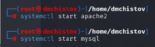
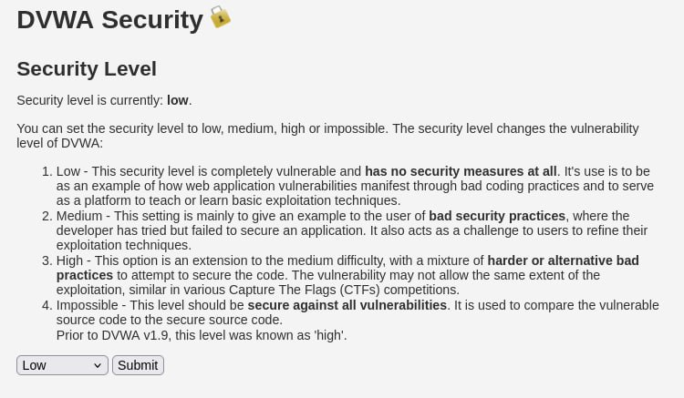
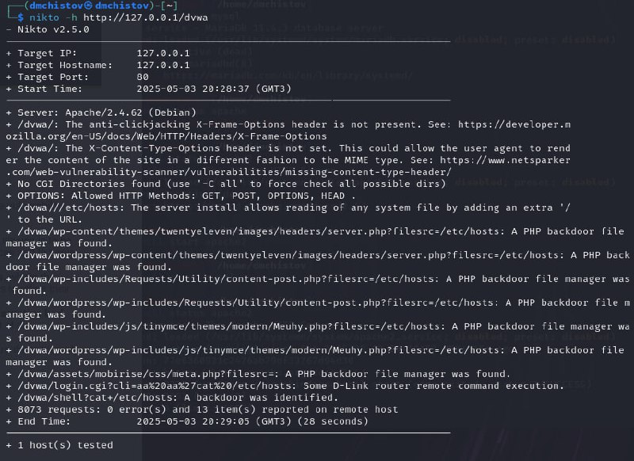

---
## Front matter
title: "Индивидуальный проект - Этап 4"
subtitle: "Основы информационной безопасности"
author: "Чистов Даниил Максимович"

## Generic otions
lang: ru-RU
toc-title: "Содержание"

## Bibliography
bibliography: bib/cite.bib
csl: pandoc/csl/gost-r-7-0-5-2008-numeric.csl

## Pdf output format
toc: true # Table of contents
toc-depth: 2
lof: true # List of figures
lot: false # List of tables
fontsize: 12pt
linestretch: 1.5
papersize: a4
documentclass: scrreprt
## I18n polyglossia
polyglossia-lang:
  name: russian
  options:
	- spelling=modern
	- babelshorthands=true
polyglossia-otherlangs:
  name: english
## I18n babel
babel-lang: russian
babel-otherlangs: english
## Fonts
mainfont: IBM Plex Serif
romanfont: IBM Plex Serif
sansfont: IBM Plex Sans
monofont: IBM Plex Mono
mathfont: STIX Two Math
mainfontoptions: Ligatures=Common,Ligatures=TeX,Scale=0.94
romanfontoptions: Ligatures=Common,Ligatures=TeX,Scale=0.94
sansfontoptions: Ligatures=Common,Ligatures=TeX,Scale=MatchLowercase,Scale=0.94
monofontoptions: Scale=MatchLowercase,Scale=0.94,FakeStretch=0.9
mathfontoptions:
## Biblatex
biblatex: true
biblio-style: "gost-numeric"
biblatexoptions:
  - parentracker=true
  - backend=biber
  - hyperref=auto
  - language=auto
  - autolang=other*
  - citestyle=gost-numeric
## Pandoc-crossref LaTeX customization
figureTitle: "Рис."
tableTitle: "Таблица"
listingTitle: "Листинг"
lofTitle: "Список иллюстраций"
lotTitle: "Список таблиц"
lolTitle: "Листинги"
## Misc options
indent: true
header-includes:
  - \usepackage{indentfirst}
  - \usepackage{float} # keep figures where there are in the text
  - \floatplacement{figure}{H} # keep figures where there are in the text
---

# Цель работы

Получение навыков пользование nikto.

## Введение

nikto - это базовый сканнер веб-приложений на уязвимости серверного уровня, т.е. ищет уязвимые файлы, скрипты, делает HTTP-запросы.

# Выполнение лабораторной работы

Перед работой надо запустить apache2 и mysql, буду тестировать nikto на dvwa (рис. [-@fig:001]).

{#fig:001 width=70%}

В начале работы я думал протестировать dvwa на разных уровнях защиты, однако оказалось это бесполезно, ведь никто проверяет веб-приложения на уязвимости другого типа, а DVWA выставляет уровни защиты, которые проявляются в логике работы самого веб-приложения, а не его серверную структуру (рис. [-@fig:002]).

{#fig:002 width=70%}

Пишем команду

```
nikto -h http://127.0.0.1/dvwa
```

Здесь -h - задаём хоста (кого будем анализировать), и дальше идёт URL нашего хоста. Также можно написать -o (имя) и после этого -F (формат) и это отправит результаты нашего сканирования в файл, чьё имя и формат мы сами задали

Команда вывела следующее: (рис. [-@fig:003])

{#fig:003 width=70%}

Здесь есть на что обратить внимание:

1. Можно узнать версию Apache, а это может помочь хакеру найти уязвимости, если уже известны уязвимости для этой версии

2. X-Frame-Options — отсутствие защиты от clickjacking (встраивание сайта в <iframe> чужого сайта - т.е. так ввести в сайт свой функционал, который может принести вред пользователю)

3. X-Content-Type-Options — отсутствие от MIME-атаки (когда браузер может неадекватно интерпретировать тип файла, например подали серверу файл txt, содержащий вредоносный код, а веб-приложение этот файл проинтерпретирует как раз как нам надо и этот код запустит.)

4. Nikto отправляет запросы к разным путям, подставляя ?filesrc=/etc/hosts и сервер возвращает содержимое файла hosts. Т.е. получается можно просматривать любые файлы Такие скрипты часто называются "file manager backdoors"

# Выводы

При выполнении данной работы я успешно получил навыки работы с nikto.

# Список литературы

[Индивидуальный проект](https://esystem.rudn.ru/mod/page/view.php?id=1220137#citeproc_bib_item_1)

[Краткое введение в nikto (видео на английском)](https://www.youtube.com/watch?v=GH9qn_DBzCk)


