---
## Front matter
title: "Индивидуальный проект - Этап 5"
subtitle: "Основы информационной безопасности"
author: "Чистов Даниил Максимович"

## Generic otions
lang: ru-RU
toc-title: "Содержание"

## Bibliography
bibliography: bib/cite.bib
csl: pandoc/csl/gost-r-7-0-5-2008-numeric.csl

## Pdf output format
toc: true # Table of contents
toc-depth: 2
lof: true # List of figures
lot: false # List of tables
fontsize: 12pt
linestretch: 1.5
papersize: a4
documentclass: scrreprt
## I18n polyglossia
polyglossia-lang:
  name: russian
  options:
	- spelling=modern
	- babelshorthands=true
polyglossia-otherlangs:
  name: english
## I18n babel
babel-lang: russian
babel-otherlangs: english
## Fonts
mainfont: IBM Plex Serif
romanfont: IBM Plex Serif
sansfont: IBM Plex Sans
monofont: IBM Plex Mono
mathfont: STIX Two Math
mainfontoptions: Ligatures=Common,Ligatures=TeX,Scale=0.94
romanfontoptions: Ligatures=Common,Ligatures=TeX,Scale=0.94
sansfontoptions: Ligatures=Common,Ligatures=TeX,Scale=MatchLowercase,Scale=0.94
monofontoptions: Scale=MatchLowercase,Scale=0.94,FakeStretch=0.9
mathfontoptions:
## Biblatex
biblatex: true
biblio-style: "gost-numeric"
biblatexoptions:
  - parentracker=true
  - backend=biber
  - hyperref=auto
  - language=auto
  - autolang=other*
  - citestyle=gost-numeric
## Pandoc-crossref LaTeX customization
figureTitle: "Рис."
tableTitle: "Таблица"
listingTitle: "Листинг"
lofTitle: "Список иллюстраций"
lotTitle: "Список таблиц"
lolTitle: "Листинги"
## Misc options
indent: true
header-includes:
  - \usepackage{indentfirst}
  - \usepackage{float} # keep figures where there are in the text
  - \floatplacement{figure}{H} # keep figures where there are in the text
---

# Цель работы

Получение навыков пользование Burp Suite.

## Введение

Burp Suite - инструмент для тестирования безопасности веб-приложений, позволяющий множеством функций перехватывать, анализировать, модифицировать разные HTTP-запросы между клиентом и сервером.

# Выполнение лабораторной работы

Запускаю Burp Suite, прохожу через пару диалоговых окон, где спрашивают, как будет устроен проект, над которым мы будем работать (рис. [-@fig:001]).

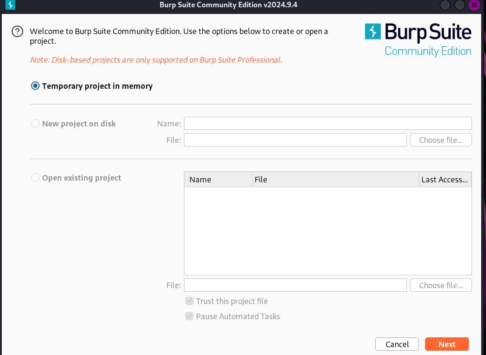{#fig:001 width=70%}

Открываю встроенный в Burp Suite браузер и открываю в нём DVWA - всё как обычно (рис. [-@fig:002]).

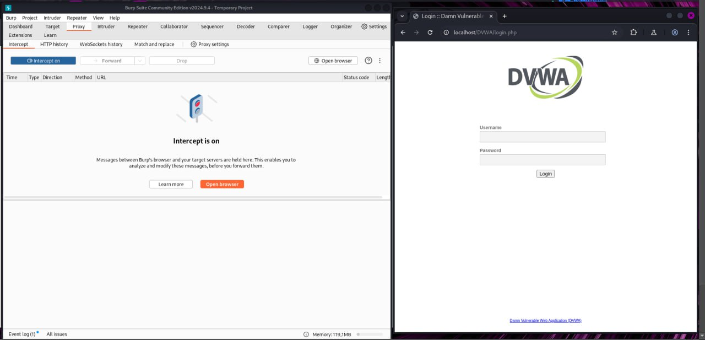{#fig:002 width=70%}

Перед работой надо запустить apache2 и mysql, буду тестировать Burp Suite на dvwa - брут форс пароля, как в этапе про Hydra, только в этот раз у DVWA будет уровень защиты "Высокий" (рис. [-@fig:003]).

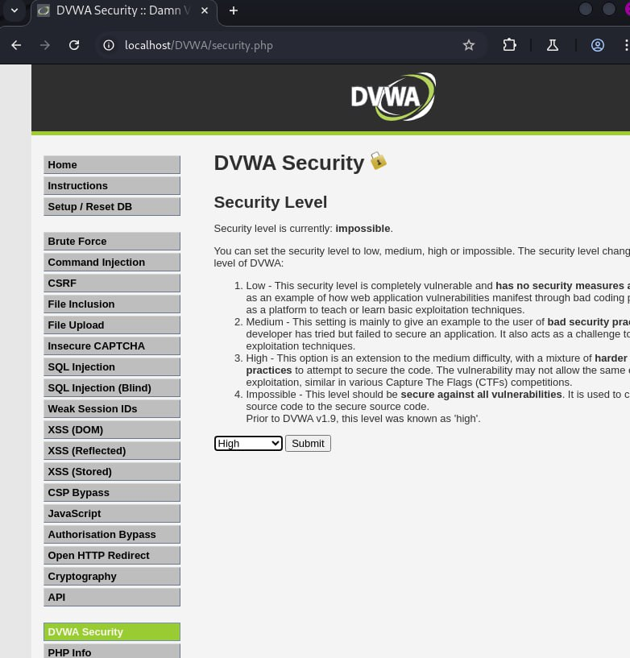{#fig:003 width=70%}

Перехожу на страничку Brute Force DVWA, там есть кнопку view source, которая позволяет посмотреть код данной странички. Такая страничка различается на разных уровнях сложности - на уровне сложности High появляется user_token, который совсем чуток усложняет брут форс (рис. [-@fig:004]).

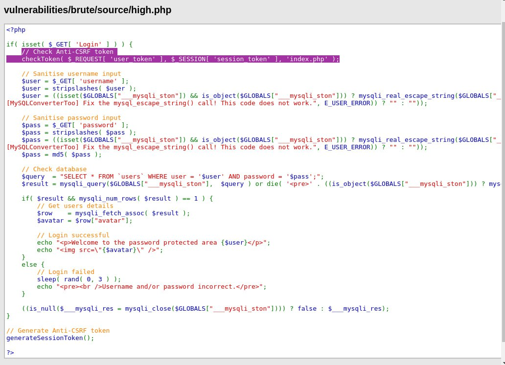{#fig:004 width=70%}

### О user_token

При каждом обновлении страницы меняется и user_token (а страница будет много обновляться при множестве неудачных попыток брут форса), сервер в свою очередь не пропускает реквесты, у которых уже устарел user_token, т.е. взломщику нужно придумать способ, как этот user_token получать автоматически при каждой попытке брут форса.

Идём далее, с помощью Burp Suite мы можем автоматизировать процесс нахождения user_token (он вшит в страничку). Захожу в настройки и во вкладке Sessions создаю новое правило (рис. [-@fig:005]).

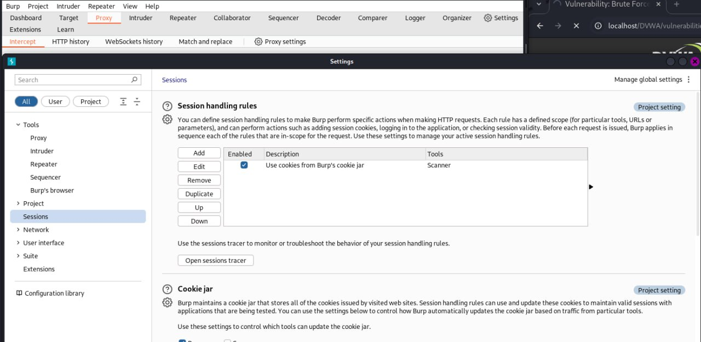{#fig:005 width=70%}

В новом правиле мы добавляем новое "макро действие", и затем настраиваем его - открывается Macro Recorder, где мы выбираем наш последний реквест - попытку входа в DVWA, оттуда мы можем посмотреть на наш реквест в виде кода и найти строчки с user_token (рис. [-@fig:006]).

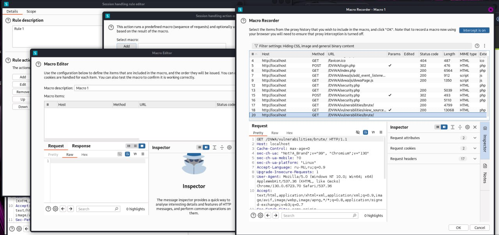{#fig:006 width=70%}

В открытом коде реквеста находим нужный параметр, за которым мы будем следить и запоминать - user_token (рис. [-@fig:007]).

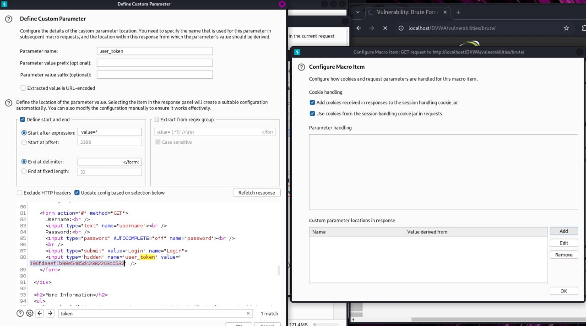{#fig:007 width=70%}

Сохраняем наше макро действие, ставим галочку "Tolerate URL mismatch when matching parameters (Use for URL-agnostic CRSF tokens)" - тут написано ставить, если мы имеем дело с юзер токенами (рис. [-@fig:008]).

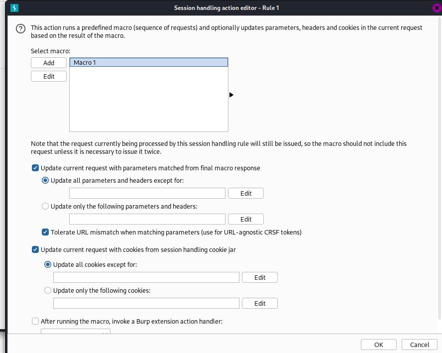{#fig:008 width=70%}

Возвращаемся в настройку правила, выставляем галочки так, чтобы это правило применялось исключительно к инструменту Intruder - им мы будем пользоваться для брут форса приложения (рис. [-@fig:009]).

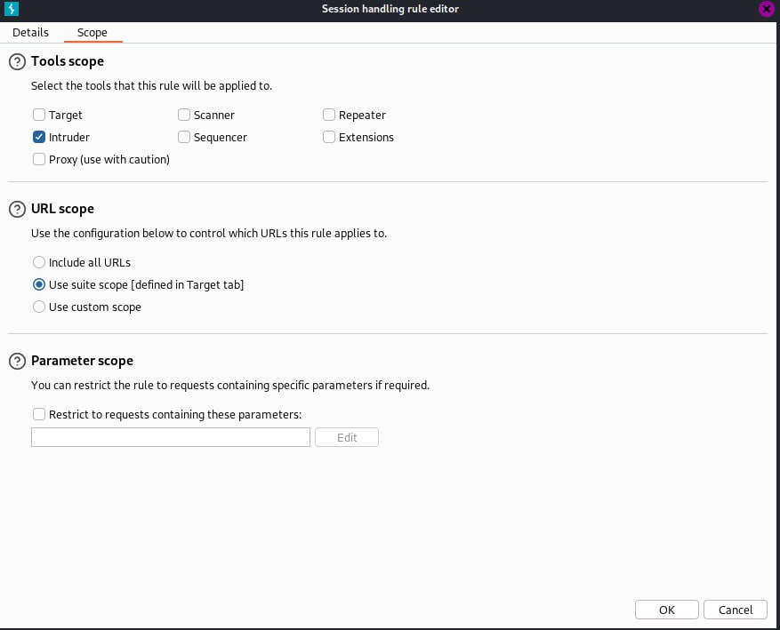{#fig:009 width=70%}

Начнём. Включаем Intercepter - перехватываем реквест с попыткой входа (рис. [-@fig:010]).

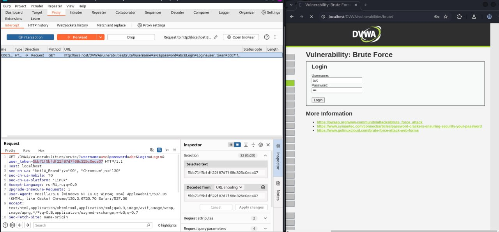{#fig:010 width=70%}

Открываем вкладку HTTP-history и находим перехваченный реквест, нажимаем на него правой кнопкой и "Send to Intruder" (отправляем в инструмент взломащика), а затем "Add to scope" (рис. [-@fig:011]).

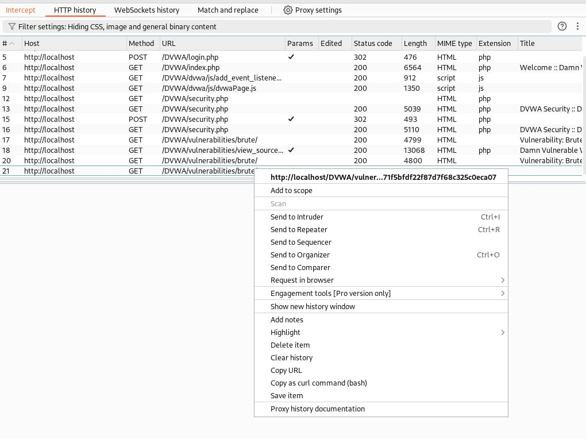{#fig:011 width=70%}

Теперь открываем вкладку "Intruder" - находим посланный нами реквест, выбираем тип атаки "Cluster Bomb" - стандартный брут форс - постоянный перебор и отправка реквестов, также выделяем значения параметра username и нажимаем "Add $", так мы выделили первый параметр, который мы будем перебирать и посылать каждый реквест - аналогично делаем и со значением переменной password (рис. [-@fig:012]).

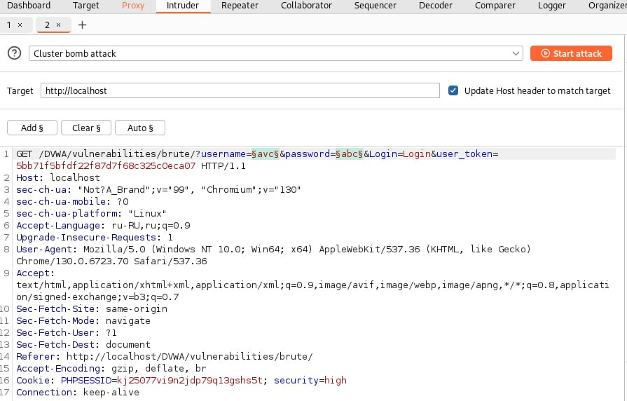{#fig:012 width=70%}

Открываем Payloads (тут мы настраиваем переменные, которые будем перебирать, т.к. мы перебираем логин и пароль, у нас их 2). Первый пейлоуд - выбираем, что будем перебирать: значения из файла, выбираем файл - в Kali есть стандартный список дефолтных логинов и паролей - они лежат в /usr/share/wordlists/metasploit. Для списка логинов выбираем http_default_users.txt (рис. [-@fig:013]).

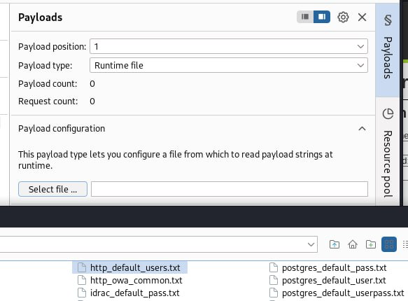{#fig:013 width=70%}

Аналогично делаем и для второго пейлоуда - перебор паролей - http_default_pass.txt (рис. [-@fig:014]).

{#fig:014 width=70%}

Открываем настройки Intruder, для наглядности добавим слово, за которым мы будем следить, и если оно появляется в коде странички - то мы ставим нашему реквесту флажок. Выбираем слово "incorrect", тогда мы обратим внимание, что при правильном наборе логина и пароля флажка не будет (рис. [-@fig:015]).

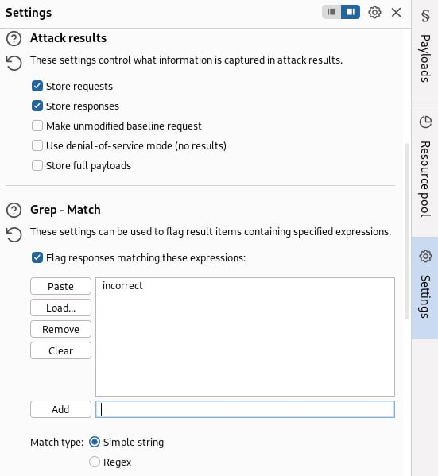{#fig:015 width=70%}

Запускаем нашего атакующего - начинаем брут форс. Наглядно видно, как посылается много реквестов. На фото я также их отсортировал по длине кода в страчничке. Обратим внимание, что тут в первой строке при логине admin и пароле password мало того, нету флажка Incorrect, так ещё и длина кода страничке значительно отличается от всех остальных - явно что-то особенное случилось при таком наборе логина и пароля. Обычно, взломщик в таком случае сам попробует такой набор логина и пароля (рис. [-@fig:016]).

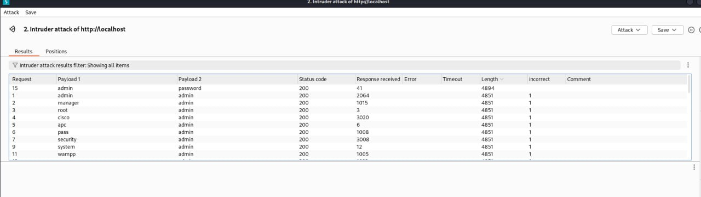{#fig:016 width=70%}

Вставляем такую комбинацию логина и пароля в страчнику входа и видим, что мы успешно прорвались в чужок аккаунт (рис. [-@fig:017]).

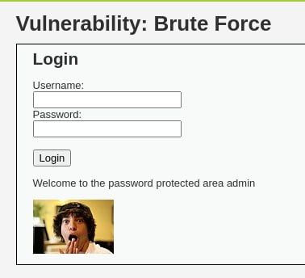{#fig:017 width=70%}

# Выводы

При выполнении данной работы я успешно получил навыки работы с Burp Suite.

# Список литературы

[Индивидуальный проект](https://esystem.rudn.ru/mod/page/view.php?id=1220137#citeproc_bib_item_1)

[Brute Force DVWA разной сложности с использованием Burp Suite (На английском)](https://www.youtube.com/watch?v=pSBD9cgwgk0)

